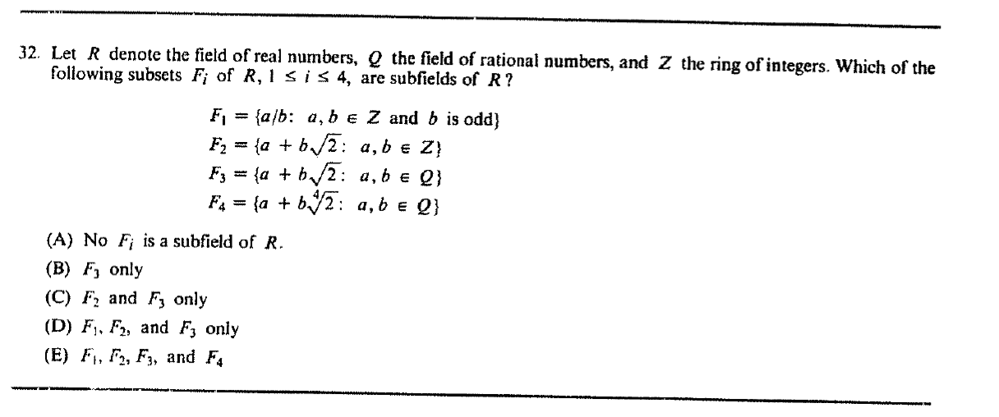

::: {.problem}
Which of the following subsets $F_i$ of $\mathbb R$, $1\le i\le4$, are subfields of $\mathbb R$?

$F_1=\{a/b:a,b\in\mathbb Z\text{ and }b\text{ is odd}\}$,

$F_2=\{a+b\sqrt2:a,b\in\mathbb Z\}$,

$F_3=\{a+b\sqrt2:a,b\in\mathbb Q\}$,

$F_4=\{a+b\sqrt[4]2:a,b\in\mathbb Q\}$.

:::
