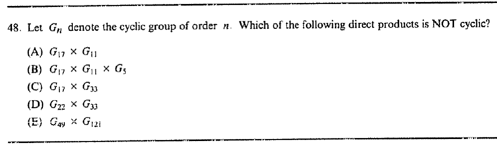

::: {.problem}
Let $G_n$ denote the cyclic group of order $n$.
Which of the listed direct products is not cyclic?

:::

::: {.solution}
A finite direct product of cyclic groups is cyclic exactly when the factor orders are pairwise coprime.

<1>1. Among the five choices, only (D), $G_{22}\times G_{33}$, is not cyclic.
::: {.proof}
The orders in (A), (B), (C), and (E) are pairwise coprime:
\[
\gcd(17,11)=1,
\quad \gcd(17,11)=\gcd(17,5)=\gcd(11,5)=1,
\]
\[
\gcd(17,33)=1,
\qquad \gcd(49,121)=1.
\]
Thus those products are cyclic.
In (D),
\[
\gcd(22,33)=11>1,
\]
so $G_{22}\times G_{33}$ is not cyclic.
:::

<1>2. Q.E.D.
::: {.proof}
By step <1>1, the answer is $\boxed{\text{(D)}}$.
:::
:::
