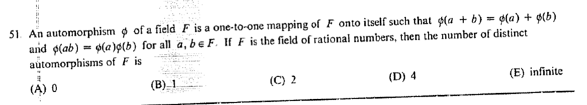

::: {.problem}

:::

::: {.solution}
Every field automorphism of $\mathbb Q$ is the identity, so the answer is $\boxed{\text{(B)}\ 1}$.

<1>1. Any automorphism fixes every rational number.
::: {.proof}
Let $\varphi:\mathbb Q\to\mathbb Q$ be a field automorphism.
Since $\varphi(1)=1$, additivity gives $\varphi(n)=n$ for every $n\in\mathbb Z$.
For $m/n\in\mathbb Q$ with $n\ne0$,
\[
\varphi(m/n)=\varphi(m)\varphi(n)^{-1}=m/n.
\]
Thus $\varphi=\operatorname{id}_{\mathbb Q}$.
:::
:::
