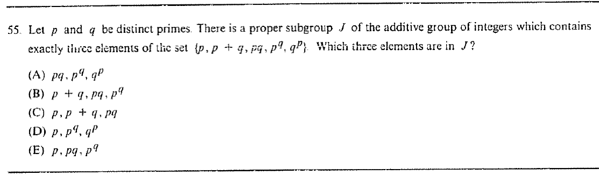

::: {.problem}

:::

::: {.solution}
The answer is $\boxed{\text{(E)}\;p,\ pq,\ p^q}$.

::: pf

::: pf-step

$J=p\mathbb Z$ is a proper subgroup of $\mathbb Z$ that contains $p$, $pq$, and $p^q$.

::: pf-proof

It is proper because $p>1$.
It contains $p$, $pq$, and $p^q$.

:::

:::

::: pf-step

The other two listed elements are not in $J$.

::: pf-proof

Because $p$ and $q$ are distinct primes, $p\nmid q$, hence $p\nmid q^p$.
Also
\[
p\mid(p+q)\iff p\mid q,
\]
which is false.
Therefore among
\[
\{p,p+q,pq,p^q,q^p\}
\]
exactly $p,pq,p^q$ lie in $J$.

:::

:::

:::

:::
