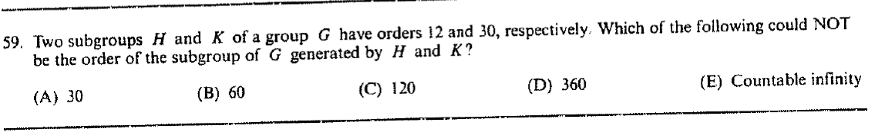

::: {.problem}

:::

::: {.solution}
The order cannot be $30$, so the answer is $\boxed{\text{(A)}}$.

<1>1. Any finite generated subgroup containing $H$ and $K$ has order divisible by $60$.
::: {.proof}
Let $L=\langle H,K\rangle$.
If $L$ is finite, Lagrange's theorem gives
\[
12\mid |L|,
\qquad 30\mid |L|.
\]
Hence
\[
\operatorname{lcm}(12,30)=60\mid |L|.
\]
Thus $|L|=30$ is impossible.
:::

<1>2. The remaining listed sizes are possible.
::: {.proof}
For order $60$, take
\[
L=C_6\times C_2\times C_5,
\quad H=C_6\times C_2\times1,
\quad K=C_6\times1\times C_5.
\]
For order $120$, take
\[
L=C_3\times C_4\times C_{10},
\quad H=C_3\times C_4\times1,
\quad K=C_3\times1\times C_{10}.
\]
For order $360$, take $L=C_{12}\times C_{30}$ with the two factors as $H$ and $K$.
In each case $H$ and $K$ generate $L$ and have the required orders.
Finally the free product
\[
C_{12}*C_{30}
\]
is countably infinite and is generated by its two canonical finite subgroups.
Thus every other listed possibility can occur.
:::
:::
