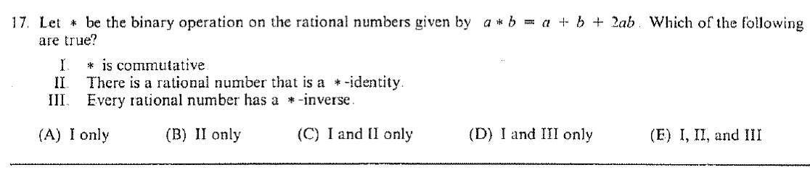

::: {.problem}
Let $*$ be the binary operation on the rational numbers given by $a*b=ab+a+b$.
Decide which of the following assertions are true: (I) $*$ is commutative; (II) there is a rational $*$-identity; (III) every rational number has a $*$-inverse.

:::

::: {.solution}
Assertions I and II are true, while III is false.

<1>1. The operation is commutative.
::: {.proof}
Since multiplication and addition in $\mathbb Q$ are commutative,
\[
a*b=ab+a+b=ba+b+a=b*a.
\]
:::

<1>2. The $*$-identity is $0$.
::: {.proof}
For every $a\in\mathbb Q$,
\[
a*0=a\cdot0+a+0=a,
\]
and by commutativity also $0*a=a$.
:::

<1>3. Not every rational has a $*$-inverse.
::: {.proof}
The identity
\[
a*b=0
\]
is equivalent to
\[
(a+1)(b+1)=1.
\]
For $a\ne-1$ this gives $b=(a+1)^{-1}-1$, but for $a=-1$ one has
\[
(-1)*b=-1
\]
for every $b$.
Thus $-1$ has no inverse.
:::

Hence exactly I and II hold.
:::
