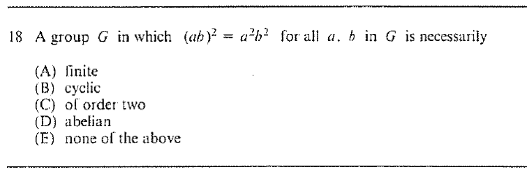

::: {.problem}

:::

::: {.solution}
The group must be abelian, so the answer is $\boxed{\text{(D)}}$.

<1>1. Cancel in the given identity.
::: {.proof}
For arbitrary $a,b\in G$,
\[
(ab)^2=a^2b^2
\]
means
\[
abab=aabb.
\]
Left-multiplying by $a^{-1}$ gives
\[
bab=abb,
\]
and right-multiplying by $b^{-1}$ gives
\[
ba=ab.
\]
Thus every pair of elements commutes and $G$ is abelian.
:::
:::
