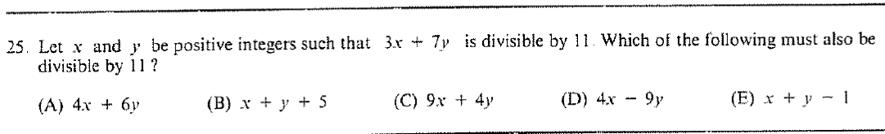

::: {.problem}
Let $x$ and $y$ be positive integers such that $3x+7y$ is divisible by $11$.
Which of the listed expressions must also be divisible by $11$?

:::

::: {.solution}
The answer is $\boxed{\text{(D)}\;4x-9y}$.

<1>1. Rewrite the hypothesis modulo $11$.
::: {.proof}
From
\[
3x+7y\equiv0\pmod{11}
\]
and $3^{-1}\equiv4\pmod{11}$, we obtain
\[
x\equiv-7\cdot4\,y\equiv5y\pmod{11}.
\]
:::

<1>2. Test the listed linear expressions.
::: {.proof}
Substituting $x\equiv5y$ gives
\[
4x-9y\equiv20y-9y=11y\equiv0\pmod{11}.
\]
The other options reduce respectively to $4y$, $6y+5$, $5y$, and $6y-1$ modulo $11$, none of which is forced to vanish for all admissible $y$.
:::
:::
