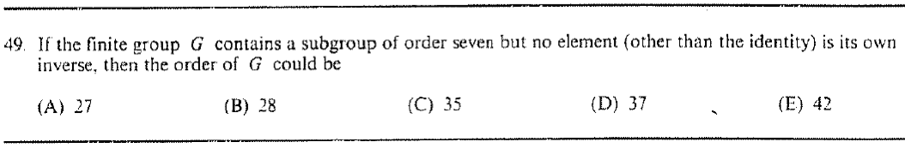

::: {.problem}

:::

::: {.solution}
The order could be $35$, so the answer is $\boxed{\text{(C)}}$.

<1>1. Necessary divisibility conditions.
::: {.proof}
Since $G$ contains a subgroup of order $7$, Lagrange's theorem gives $7\mid|G|$.
Since no nonidentity element is its own inverse, $G$ has no element of order $2$.
By Cauchy's theorem, $|G|$ must therefore be odd.
:::

<1>2. Check the choices and exhibit an example.
::: {.proof}
Among $27,28,35,37,42$, the only odd multiple of $7$ is $35$.
This value occurs: the cyclic group $C_{35}$ contains a subgroup of order $7$ and, being of odd order, has no nontrivial element of order $2$.
:::
:::
