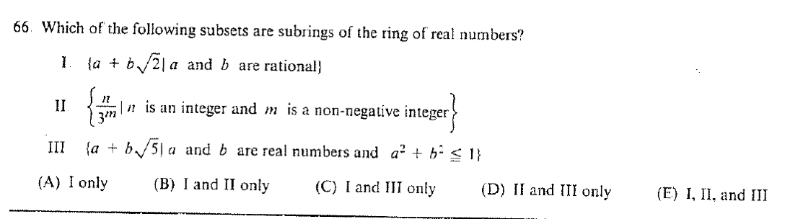

::: {.problem}
Which of the following subsets are subrings of the ring of real numbers?

I. $\{a+b\sqrt2:a,b\in\mathbb Q\}$.

II. $\{n/3^m:n\in\mathbb Z,\ m\ge0\}$.

III. $\{a+b\sqrt5:a,b\in\mathbb R,\ a^2+b^2\le1\}$.

:::

::: {.solution}
Exactly I and II are subrings of $\mathbb R$.

<1>1. I is a subring.
::: {.proof}
The set
\[
\mathbb Q(\sqrt2)=\{a+b\sqrt2:a,b\in\mathbb Q\}
\]
is closed under addition, additive inverses, and multiplication, and contains $1$; in fact it is a field.
:::

<1>2. II is a subring.
::: {.proof}
The set
\[
\left\{\frac n{3^m}:n\in\mathbb Z,\ m\ge0\right\}=\mathbb Z[1/3]
\]
is closed under subtraction.
Also
\[
\frac n{3^m}\frac r{3^s}=\frac{nr}{3^{m+s}},
\]
so it is closed under multiplication and contains $1$.
:::

<1>3. III is not a subring.
::: {.proof}
The element $1=1+0\sqrt5$ lies in III, but
\[
1+1=2
\]
does not, since its coefficients satisfy $2^2+0^2=4>1$.
Thus III is not closed under addition.
:::
:::
