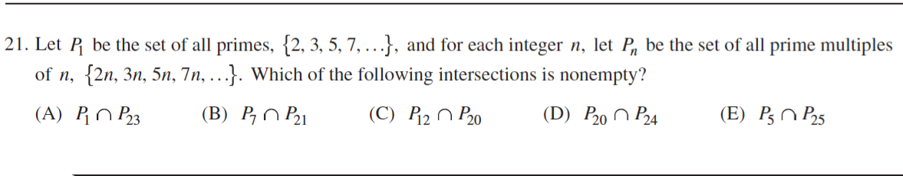

::: {.problem}
Let $P$ be the set of all primes, and for each integer $n$ let $P_n$ be the set of all prime multiples of $n$.
Which of the listed intersections is nonempty?

:::

::: {.solution}
The nonempty intersection is $\boxed{\text{(C)}\;P_{12}\cap P_{20}}$.

<1>1. Exhibit an element of choice (C).
::: {.proof}
By definition $P_n=\{pn:p\text{ prime}\}$.
Since
\[
60=5\cdot12=3\cdot20,
\]
we have $60\in P_{12}\cap P_{20}$.
:::

<1>2. The other intersections are empty.
::: {.proof}
An equality $ap=bq$ with $p,q$ prime forces the prime factors of $a,b$ to match appropriately.

- $p=23q$ cannot hold with both $p,q$ prime, so $P_1\cap P_{23}=\varnothing$.

- $7p=21q$ gives $p=3q$, impossible for primes.

- $20p=24q$ gives $5p=6q$; then $q$ divides $5p$, forcing $q=5$ or $q=p$, neither satisfying the equation.

- $5p=25q$ gives $p=5q$, impossible for primes.

Thus only (C) is nonempty.
:::
:::
