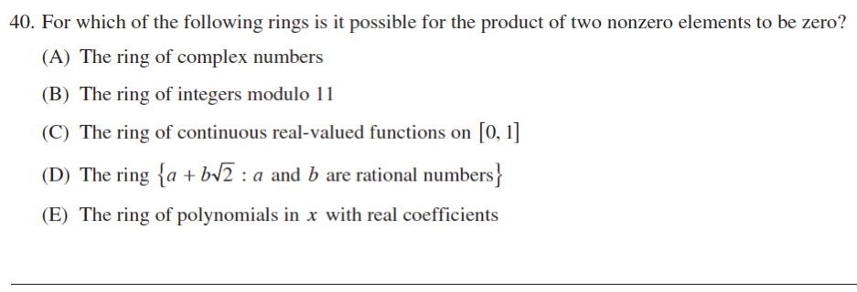

::: {.problem}
Let $G=\{1,i,-1,-i\}$ under multiplication.
Decide which listed assertions about homomorphisms $G\to G$ are true, including complex conjugation, squaring, and the claim that every endomorphism is $z\mapsto z^k$ for some integer $k$.

:::
