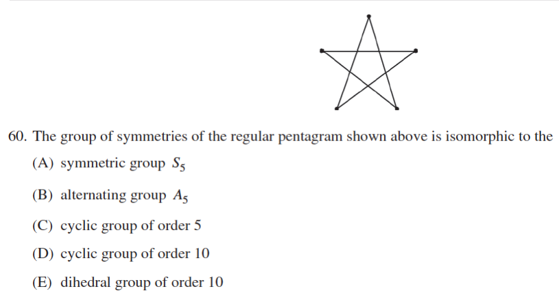

::: {.problem}

:::

::: {.solution}
The successive remainders are
\[
\boxed{53,4,1,0},
\]
so the answer is $\boxed{\text{(D)}}$.

<1>1. Execute the Euclidean algorithm.
::: {.proof}
\[
273=2\cdot110+53,
\]
so the first remainder is $53$.
Then
\[
110=2\cdot53+4,
\]
so the second is $4$.
Next
\[
53=13\cdot4+1,
\]
and finally
\[
4=4\cdot1+0.
\]
Thus the algorithm computes $r=53,4,1,0$ in order.
:::
:::
