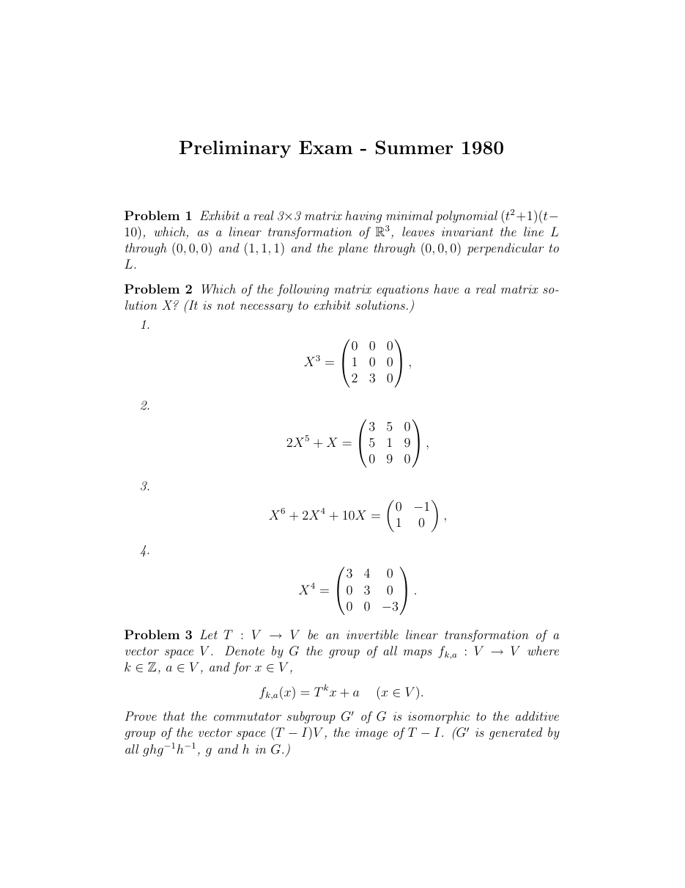

::: {.problem}
Which of the following matrix equations have a real matrix solution $X$? (It is not necessary to exhibit solutions.)

:::

::: {.solution}
The four equations have real matrix solutions exactly in cases **2** and **3**.

<1>1. Equation 1 has no real matrix solution.
::: {.proof}
Let
\[
N=\begin{pmatrix}
0&0&0\\
1&0&0\\
2&3&0
\end{pmatrix}.
\]
Suppose that a real $3\times3$ matrix $X$ satisfied $X^3=N$.
Then every eigenvalue $\lambda$ of $X$ satisfies $\lambda^3=0$, because every eigenvalue of $X^3=N$ is $0$. Hence every eigenvalue of $X$ is $0$, so the characteristic polynomial of $X$ is $t^3$.
By Cayley--Hamilton,
\[
X^3=0,
\]
contrary to $N\ne0$. Thus no such $X$ exists.
:::

<1>2. Equation 2 has a real matrix solution.
::: {.proof}
Let
\[
B=\begin{pmatrix}
3&5&0\\
5&1&9\\
0&9&0
\end{pmatrix}
\]
and let $f(t)=2t^5+t$.
The matrix $B$ is real symmetric, so there is an orthogonal matrix $Q$ and real numbers $\lambda_1,\lambda_2,\lambda_3$ such that
\[
B=Q\operatorname{diag}(\lambda_1,\lambda_2,\lambda_3)Q^T.
\]
Moreover
\[
f'(t)=10t^4+1>0
\]
for every real $t$, and $f(t)\to\pm\infty$ as $t\to\pm\infty$.
Thus $f:\mathbb R\to\mathbb R$ is bijective. Choose real $\mu_i$ with
\[
f(\mu_i)=\lambda_i.
\]
Then
\[
X=Q\operatorname{diag}(\mu_1,\mu_2,\mu_3)Q^T
\]
is real and satisfies
\[
2X^5+X=B.
\]
:::

<1>3. Equation 3 has a real matrix solution.
::: {.proof}
Identify $\mathbb R^2$ with $\mathbb C$, so that the matrix
\[
J=\begin{pmatrix}0&-1\\1&0\end{pmatrix}
\]
represents multiplication by $i$.
Consider the complex polynomial
\[
p(z)=z^6+2z^4+10z.
\]
By the fundamental theorem of algebra, the nonconstant polynomial
\[
p(z)-i
\]
has a complex root $z_0=a+bi$.
Let
\[
X=\begin{pmatrix}a&-b\\b&a\end{pmatrix},
\]
the real matrix representing multiplication by $z_0$ on $\mathbb C\cong\mathbb R^2$.
Polynomial evaluation respects this representation, so $p(X)$ represents multiplication by $p(z_0)=i$. Therefore
\[
X^6+2X^4+10X=J.
\]
Hence a real matrix solution exists.
:::

<1>4. Equation 4 has no real matrix solution.
::: {.proof}
Let
\[
C=\begin{pmatrix}
3&4&0\\
0&3&0\\
0&0&-3
\end{pmatrix}.
\]
Suppose $X^4=C$. Since $X$ commutes with every power of itself,
\[
XC=X^5=CX.
\]
Hence $X$ preserves every eigenspace of $C$. In particular, the $(-3)$-eigenspace
\[
E_{-3}=\ker(C+3I)=\operatorname{span}(e_3)
\]
is $X$-invariant.
Because this space is one-dimensional over $\mathbb R$, the restriction of $X$ to it is multiplication by some real number $r$. Restricting $X^4=C$ to $E_{-3}$ gives
\[
r^4=-3,
\]
which is impossible over $\mathbb R$.
Thus no real fourth root exists.
:::
:::
