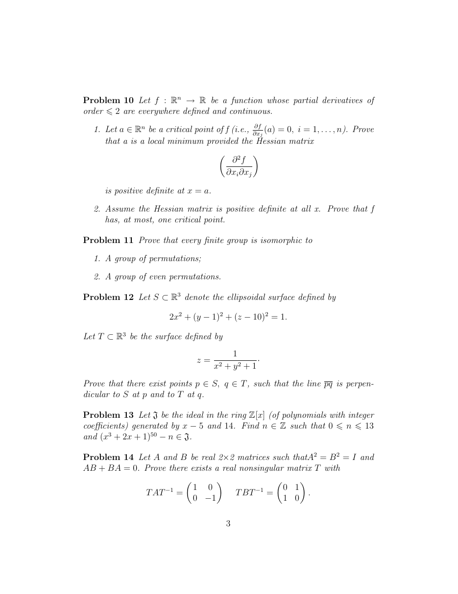

::: {.problem}
Let $A$ and $B$ be real $2\times2$ matrices such that $A^2=B^2=I$ and $AB+BA=0$. Prove there exists a real nonsingular matrix $T$ with

\[
T^{-1}AT=\begin{pmatrix}1&0\\0&-1\end{pmatrix},\qquad T^{-1}BT=\begin{pmatrix}0&1\\1&0\end{pmatrix}.
\]

:::

::: {.solution}
Because $A^2=I$, the minimal polynomial of $A$ divides
\[
(t-1)(t+1).
\]
The two roots are distinct over $\mathbb R$, so $A$ is diagonalizable with eigenvalues among $\{1,-1\}$.

<1>1. Both eigenvalues $1$ and $-1$ occur for $A$.
::: {.proof}
If $A=I$, then
\[
AB+BA=2B=0,
\]
which is impossible because $B^2=I$ makes $B$ invertible.
Similarly, $A=-I$ would give
\[
AB+BA=-2B=0,
\]
again impossible.
Since $A$ is a diagonalizable real $2\times2$ matrix whose only possible eigenvalues are $\pm1$, it follows that both occur, each with a one-dimensional eigenspace.
:::

<1>2. $B$ interchanges the two eigenspaces of $A$.
::: {.proof}
Let $v$ satisfy
\[
Av=\lambda v,
\qquad \lambda\in\{1,-1\}.
\]
From $AB=-BA$,
\[
A(Bv)=-B(Av)=-\lambda Bv.
\]
Because $B$ is invertible, $Bv\ne0$ whenever $v\ne0$.
Thus $B$ maps the $\lambda$-eigenspace of $A$ isomorphically onto the $(-\lambda)$-eigenspace.
:::

<1>3. Choose a basis that gives the required matrices.
::: {.proof}
Choose a nonzero vector $u$ with
\[
Au=u.
\]
Then by <1>2,
\[
A(Bu)=-Bu,
\]
so $u$ and $Bu$ belong to distinct eigenspaces and therefore form a basis of $\mathbb R^2$.
Let $T$ be the matrix whose columns are $u$ and $Bu$.
Then, in this basis,
\[
A u=u,
\qquad
A(Bu)=-Bu,
\]
so
\[
T^{-1}AT=
\begin{pmatrix}
1&0\\
0&-1
\end{pmatrix}.
\]
Also
\[
Bu=Bu,
\qquad
B(Bu)=B^2u=u,
\]
so
\[
T^{-1}BT=
\begin{pmatrix}
0&1\\
1&0
\end{pmatrix}.
\]
Since $(u,Bu)$ is a basis, $T$ is real and nonsingular, as required.
:::
:::
