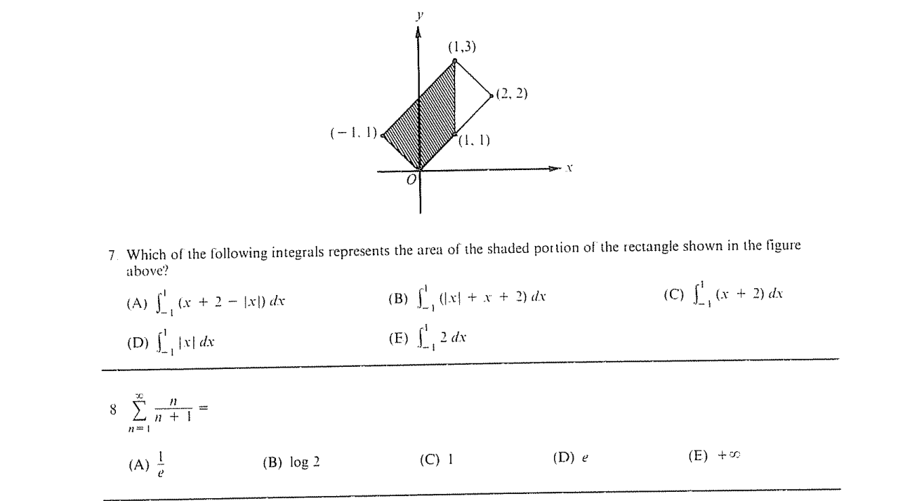

::: {.problem}

Which of the following integrals represents the area of the shaded portion of the rectangle shown in the figure above?

(A) $\int_{-1}^{1} (x + 2 - \abs{x}) \, dx$
(B) $\int_{-1}^{1} (\abs{x} + x + 2) \, dx$
(C) $\int_{-1}^{1} (x + 2) \, dx$
(D) $\int_{-1}^{1} \abs{x} \, dx$
(E) $\int_{-1}^{1} 2 \, dx$
:::
