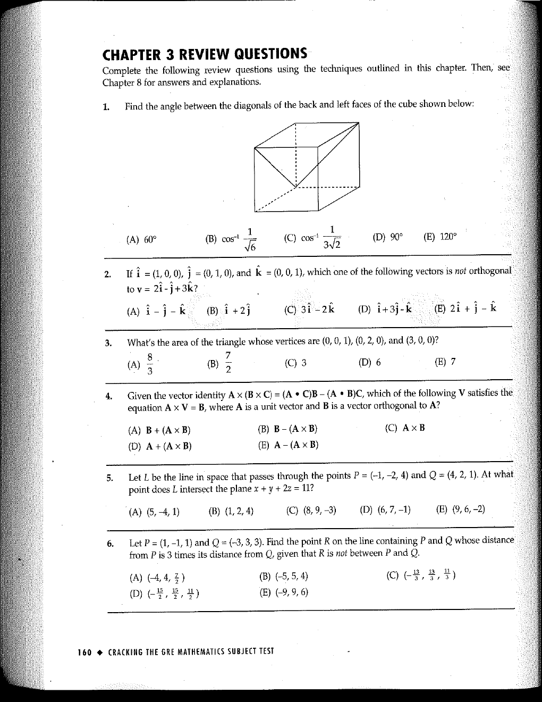

::: {.problem}
What's the area of the triangle whose vertices are (0, 0, 1), (0, 2, 0), and (3, 0, 0)? (A) $\frac { 8 } { 3 }$ (B) $\frac { 7 } { 2 }$ (C) $3$ (D) [choice (D) value lost in the scan] (E) $7$

:::
