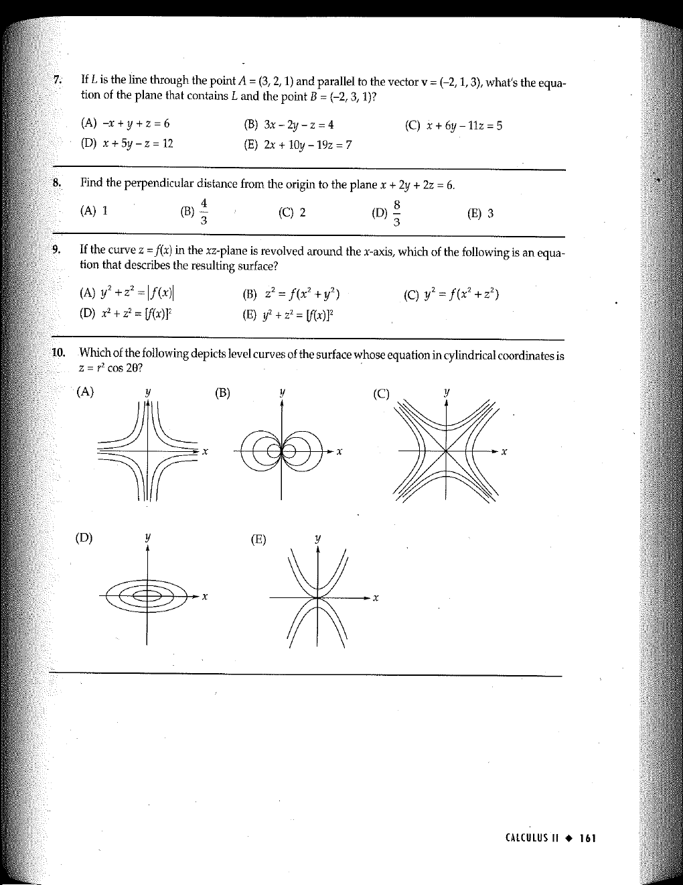

::: {.problem}
Which of the following depicts level curves of the surface whose equation in cylindrical coordinates is $z=r^2\cos 2\theta$?

The five graphical choices (A)–(E) appear on the source page:

:::
