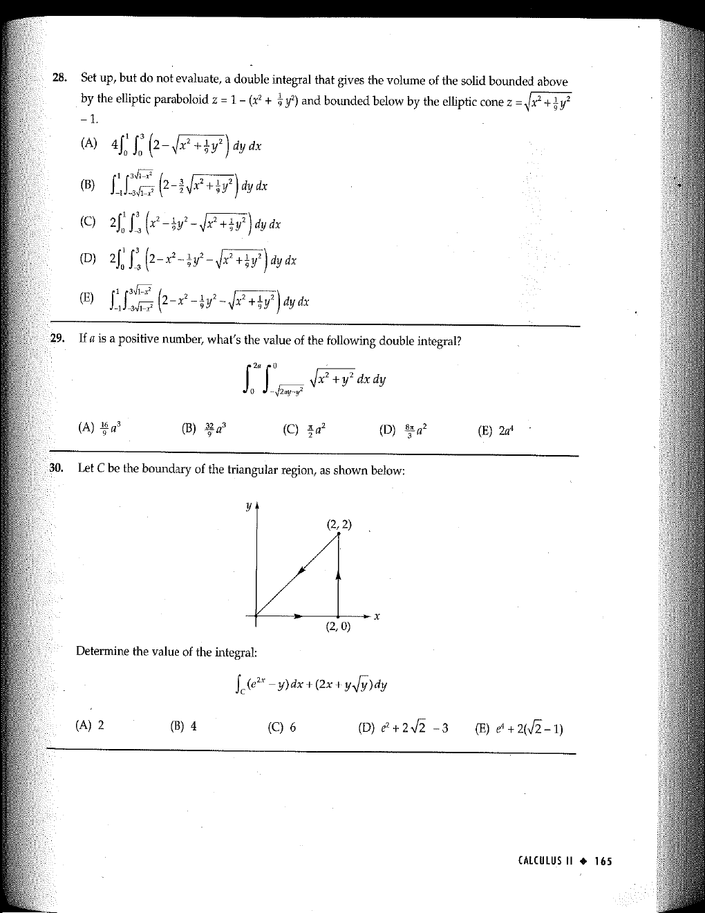

::: {.problem}
Let $C$ be the boundary of the triangular region, as shown below:

Determine the value of the integral:
\[
\int_C(e^{2x}-y)\,dx+(2x+y\sqrt{y})\,dy
\]

(A) $2$
(B) $4$
(C) $6$
(D) $e^2+2\sqrt{2}-3$
(E) $e^4+2(\sqrt{2}-1)$
:::
