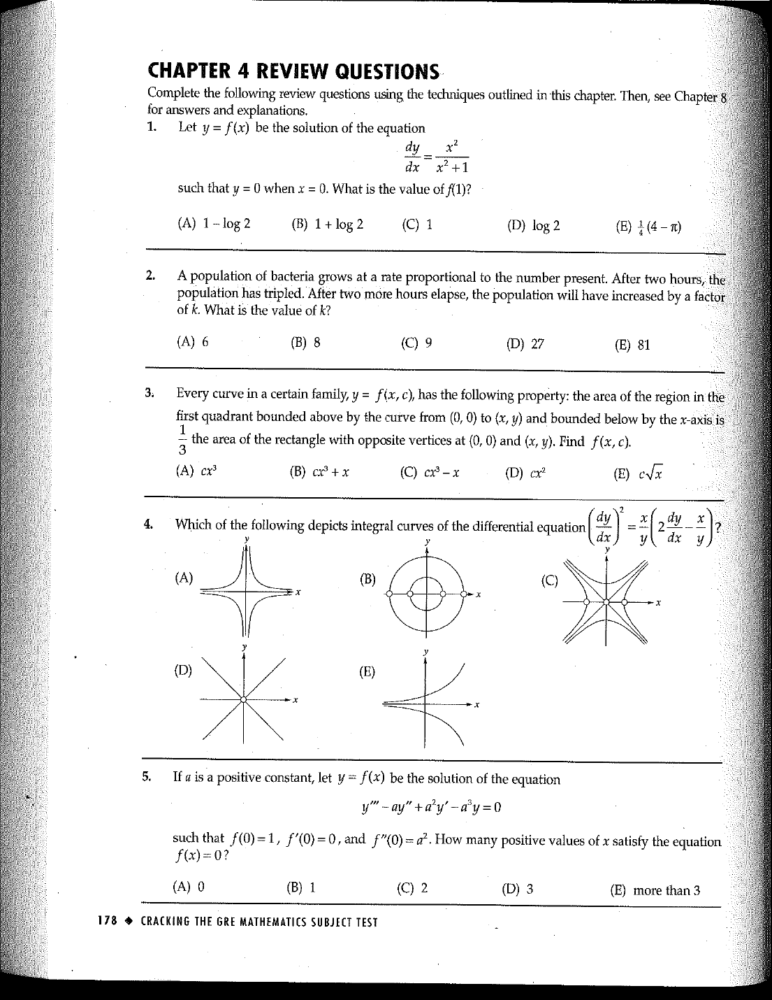

::: {.problem}
A population of bacteria grows at a rate proportional to the number present.
The OCR extraction loses part of the numerical data in Question 2; use the preserved source scan as the authoritative statement.

:::
