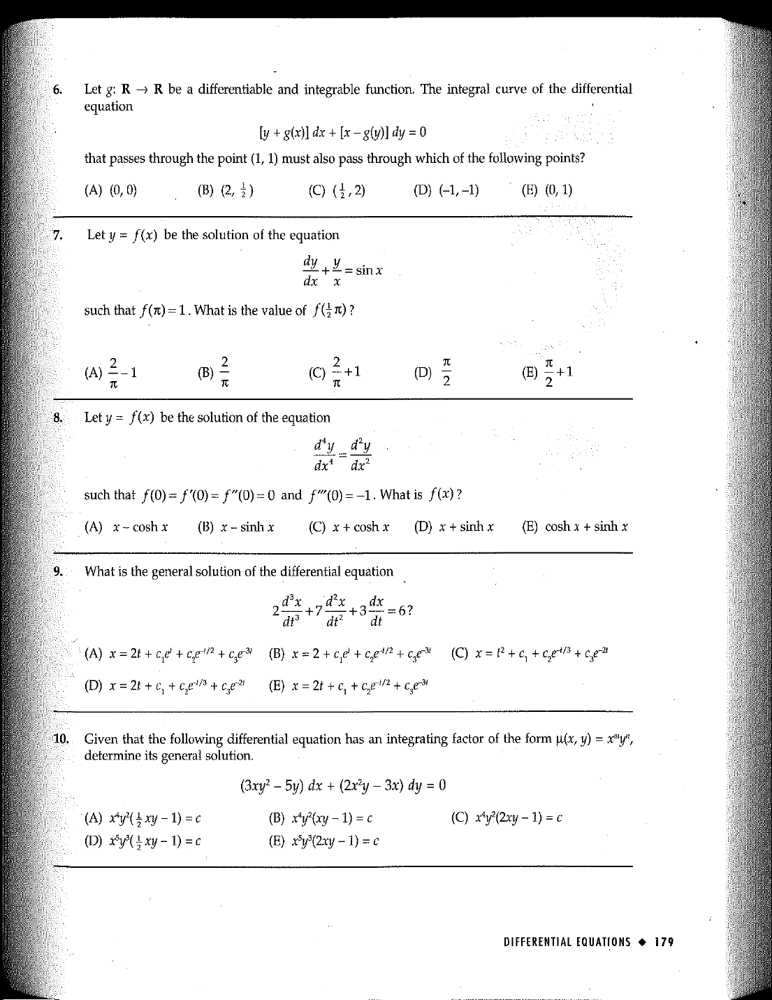

::: {.problem}
Given that
\[
(3xy^2-5y)\,dx+(2x^2y-3x)\,dy=0
\]
has an integrating factor of the form $\mu(x,y)=x^my^n$, determine its general solution.
The first answer choice is OCR-damaged in the extraction; the source scan is authoritative.

:::
