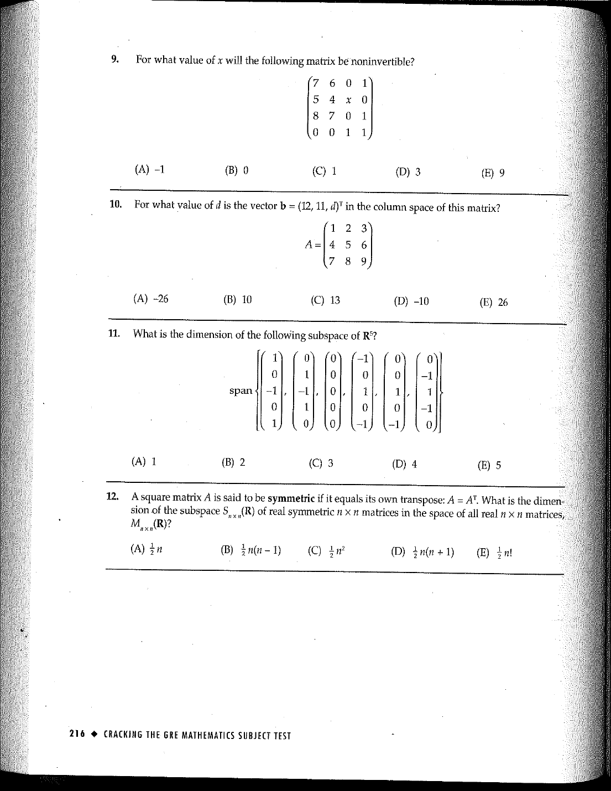

::: {.problem}
What is the dimension of the subspace of $\mathbb R^5$ displayed in Question 11 on the source page?
The OCR extraction corrupts two vector lengths, so use the preserved scan below as the authoritative statement.

:::
