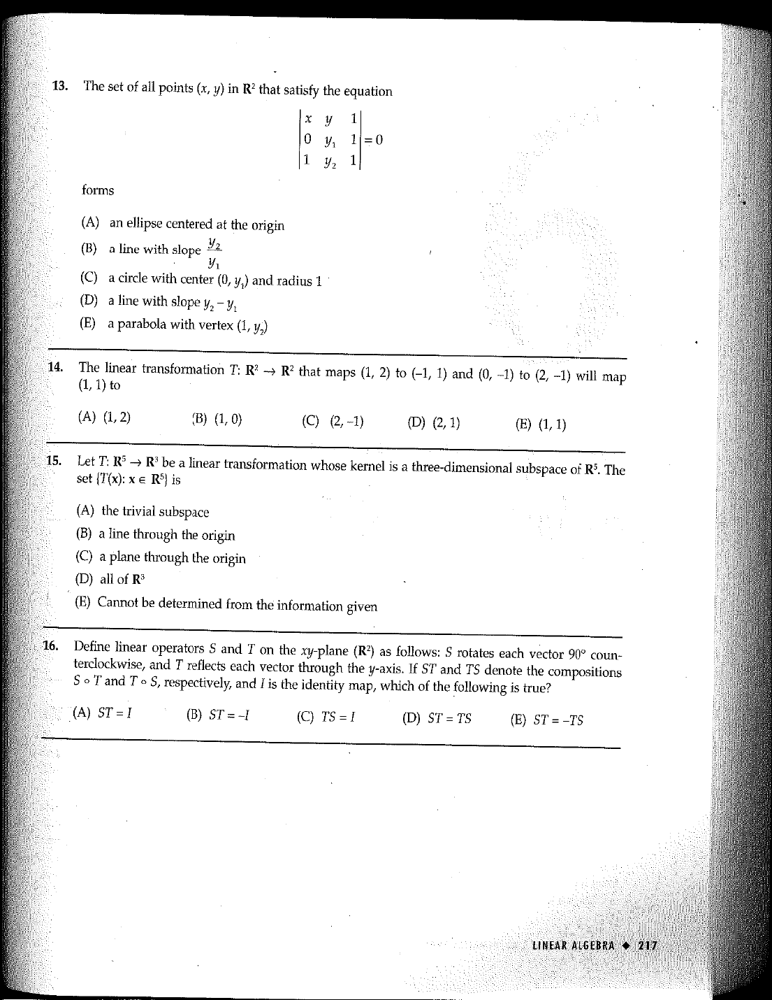

::: {.problem}
Question 14 asks for the image of $(1,1)$ under a linear transformation $T:\mathbb R^2\to\mathbb R^2$ specified by the images of two vectors.
The OCR extraction drops coordinates in those vectors; use the preserved source scan below as the authoritative statement.

:::
