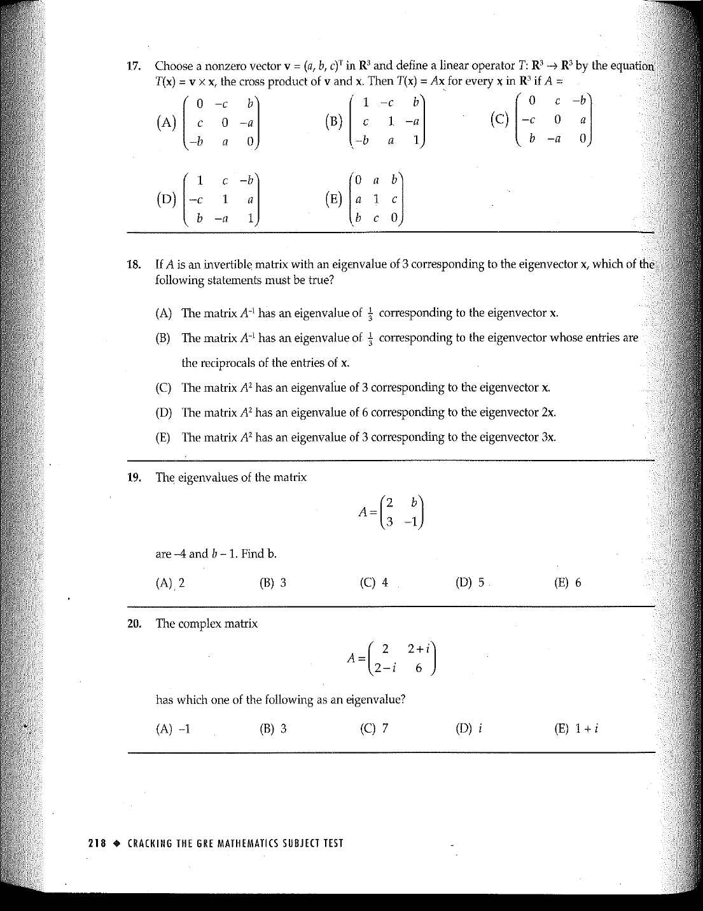

::: {.problem}
The complex matrix
\[A=\begin{pmatrix}2&2+i\\2-i&6\end{pmatrix}\]
has which one of the following as an eigenvalue? The OCR extraction drops two answer choices; use the preserved source scan below as authoritative.

(A) $-1$  (D) $i$  (E) $1+i$

:::
