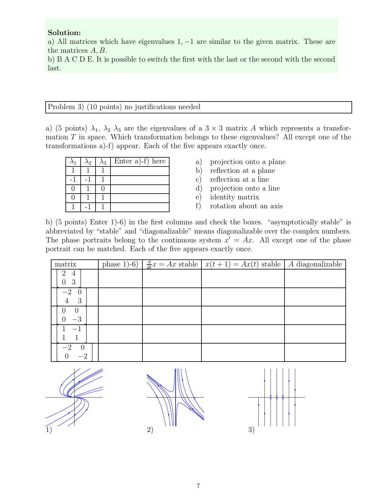

::: {.problem}
No justifications are required.

(a) For each eigenvalue triple below, identify the corresponding transformation from the list. Exactly five of the six transformations occur, each once.

| $(\lambda_1,\lambda_2,\lambda_3)$ | Choices |
| --- | --- |
| $(1,1,1)$ | projection onto a plane |
| $(-1,-1,1)$ | reflection at a plane |
| $(0,1,0)$ | reflection at a line |
| $(0,1,1)$ | projection onto a line |
| $(1,-1,1)$ | identity; rotation about an axis |

(b) For each of the five matrices shown on the source page, match one of phase portraits 1--6, decide whether the continuous system $x'=Ax$ is asymptotically stable, decide whether the discrete system $x(t+1)=Ax(t)$ is asymptotically stable, and decide whether $A$ is diagonalizable over $\mathbb C$. One phase portrait is unused.

:::
