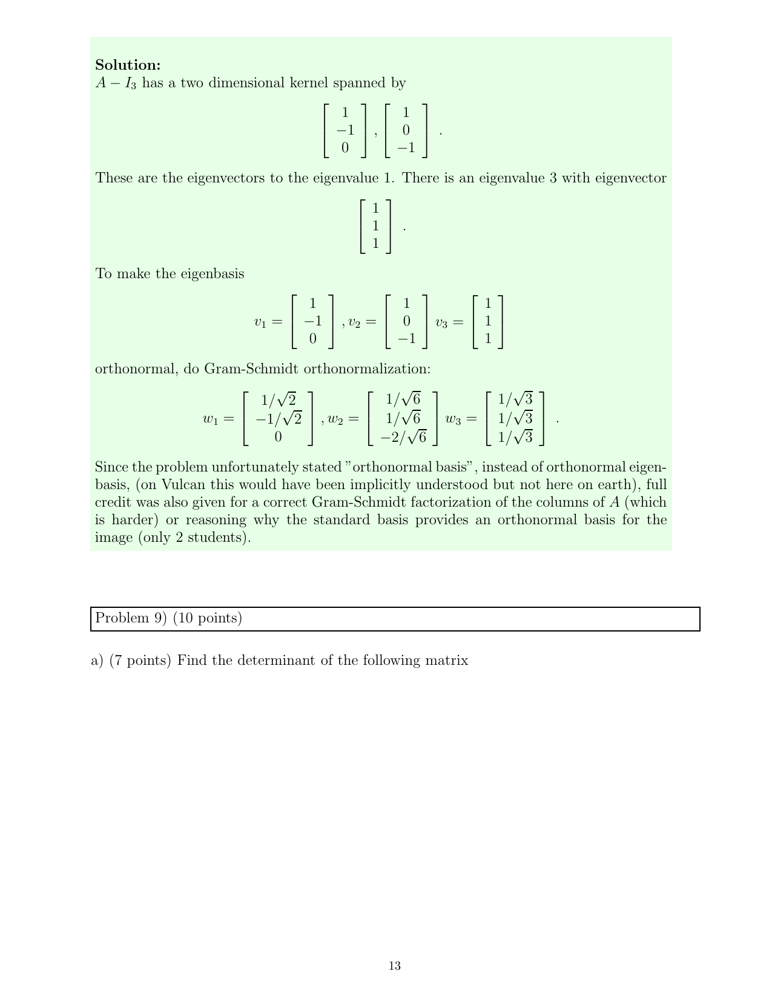

::: {.problem}
(a) Find the determinant of the $15\times15$ matrix displayed on the source page. Mention all tools used to obtain the answer.

(b) Find $\det X$ for a $5\times5$ matrix $X$ satisfying
\[
AXA=B,
\]
where $A$ is a reflection at a one-dimensional line in $\mathbb R^5$ and $B$ is a reflection at a two-dimensional plane in $\mathbb R^5$. Justify the answer.
:::
