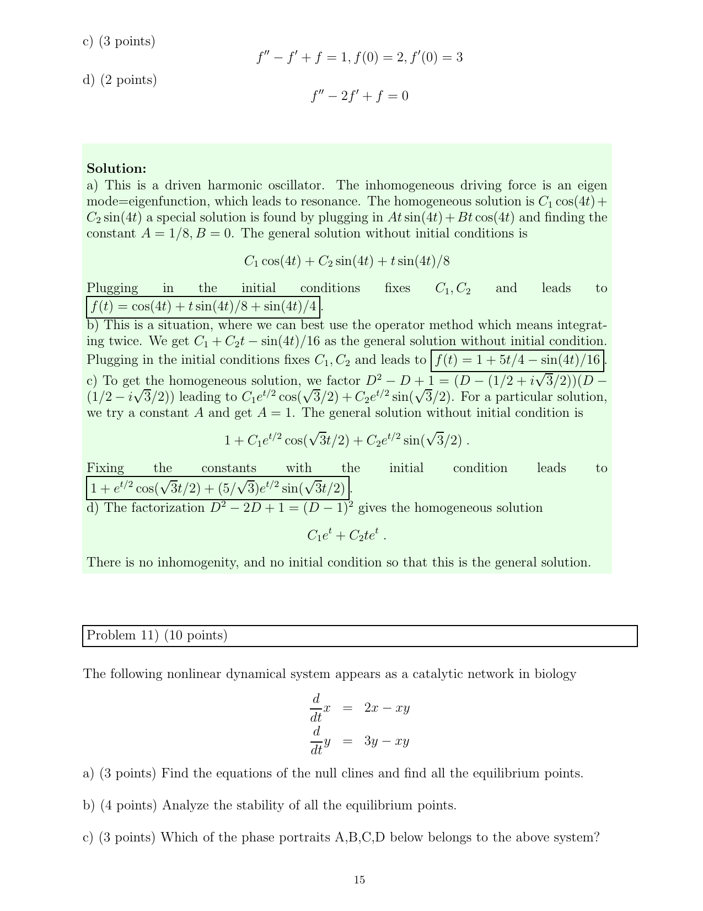

::: {.problem}
Consider the nonlinear system
\[
\dot x=2x-xy,\qquad \dot y=3y-xy.
\]

(a) Find the nullclines and all equilibrium points.

(b) Analyze the stability of every equilibrium point.

(c) Choose the phase portrait A--D on the source page that belongs to this system.

:::

::: {.solution}
<1>1. Determine the nullclines and equilibrium points.
::: {.proof}
The first component factors as
$$
\dot x=2x-xy=x(2-y),
$$
so the $x$-nullcline is
$$
x=0\quad\text{or}\quad y=2.
$$
Similarly,
$$
\dot y=3y-xy=y(3-x),
$$
so the $y$-nullcline is
$$
y=0\quad\text{or}\quad x=3.
$$
The simultaneous intersections are therefore
$$
\boxed{(0,0)\quad\text{and}\quad(3,2)}.
$$
:::

<1>2. Linearize at the origin.
::: {.proof}
The Jacobian matrix is
$$
J(x,y)=
\begin{pmatrix}
2-y&-x\\
-y&3-x
\end{pmatrix}.
$$
At $(0,0)$,
$$
J(0,0)=
\begin{pmatrix}2&0\\0&3\end{pmatrix}.
$$
Its eigenvalues are $2$ and $3$, both positive. Thus $(0,0)$ is a
hyperbolic source and hence unstable.
:::

<1>3. Linearize at $(3,2)$.
::: {.proof}
At the second equilibrium,
$$
J(3,2)=
\begin{pmatrix}0&-3\\-2&0\end{pmatrix}.
$$
Its characteristic polynomial is
$$
\lambda^2-6,
$$
so the eigenvalues are
$$
\lambda=\pm\sqrt6.
$$
One is positive and one negative, so $(3,2)$ is a hyperbolic saddle and is
also unstable. In particular, neither equilibrium is asymptotically stable.
:::

<1>4. Match the phase portrait.
::: {.proof}
The required portrait must show a source at the origin together with a saddle
at $(3,2)$. Among the four source figures, only portrait A has this local
behavior at both equilibria. Therefore
$$
\boxed{\text{portrait A}.}
$$
:::
:::
