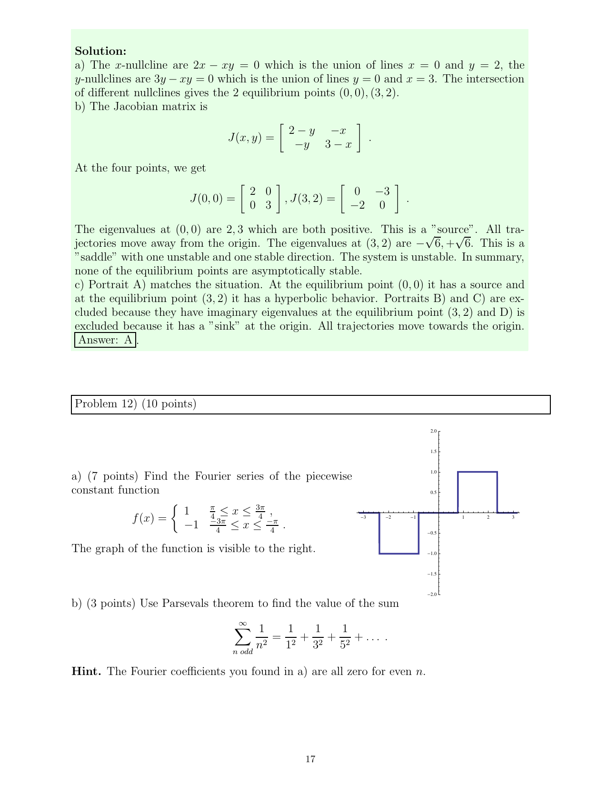

::: {.problem}
The source graph defines a piecewise-constant function on $[-\pi,\pi]$ taking value $1$ on $[\pi/4,3\pi/4]$, value $-1$ on $[-3\pi/4,-\pi/4]$, and value $0$ elsewhere.

(a) Find its Fourier series.

(b) Use Parseval's theorem to evaluate
\[
\sum_{\substack{n\ge1\\ n\text{ odd}}}\frac1{n^2}
=1+\frac1{3^2}+\frac1{5^2}+\cdots.
\]
The Fourier coefficients from part (a) vanish for even $n$.
:::
