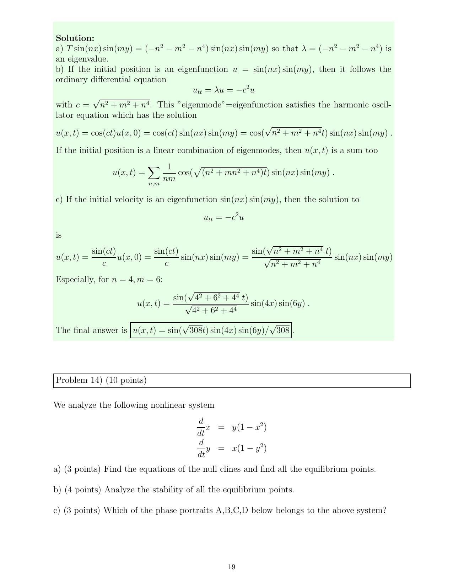

::: {.problem}
Consider
\[
\dot x=y(1-x^2),\qquad \dot y=x(1-y^2).
\]

(a) Find the nullclines and all equilibrium points.

(b) Analyze the stability of every equilibrium point.

(c) Choose the phase portrait A--D on the source page that belongs to this system.

:::
