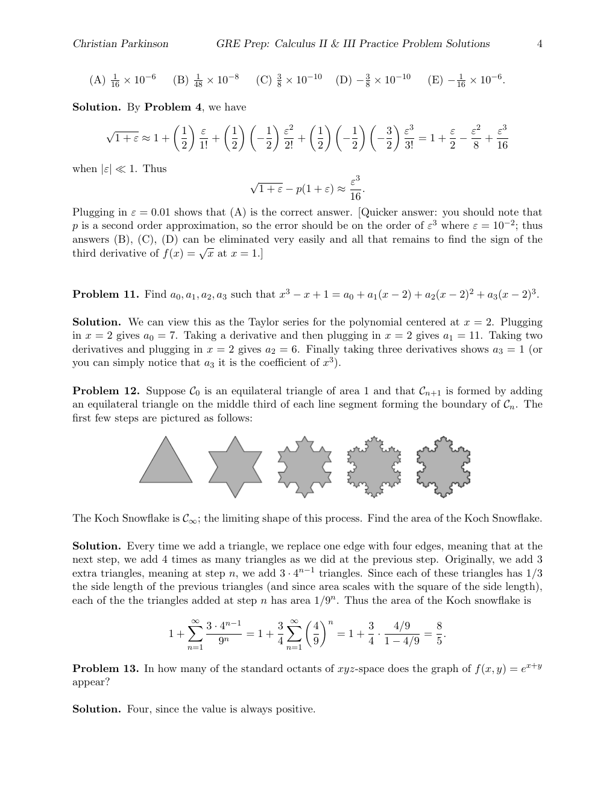

::: {.problem}
Suppose $\mathcal { C } _ { 0 }$ is an equilateral triangle of area 1 and that $\mathcal { C } _ { n + 1 }$ is formed by adding an equilateral triangle on the middle third of each line segment forming the boundary of ${ \mathcal { C } } _ { n }$ . The first few steps are pictured as follows:

The Koch Snowflake is $\mathcal { C } _ { \infty }$ ; the limiting shape of this process.
Find the area of the Koch Snowflake.

:::

::: {.solution}
Every time we add a triangle, we replace one edge with four edges, meaning that at the next step, we add 4 times as many triangles as we did at the previous step.
Originally, we add 3 extra triangles, meaning at step n, we add $3 \cdot 4 ^ { n - 1 }$ triangles.
Since each of these triangles has $1 / 3$ the side length of the previous triangles (and since area scales with the square of the side length), each of the the triangles added at step n has area $1 / 9 ^ { n }$ . Thus the area of the Koch snowflake is

$$
1 + \sum _ { n = 1 } ^ { \infty } { \frac { 3 \cdot 4 ^ { n - 1 } } { 9 ^ { n } } } = 1 + { \frac { 3 } { 4 } } \sum _ { n = 1 } ^ { \infty } \left( { \frac { 4 } { 9 } } \right) ^ { n } = 1 + { \frac { 3 } { 4 } } \cdot { \frac { 4 / 9 } { 1 - 4 / 9 } } = { \frac { 8 } { 5 } } .
$$
:::
