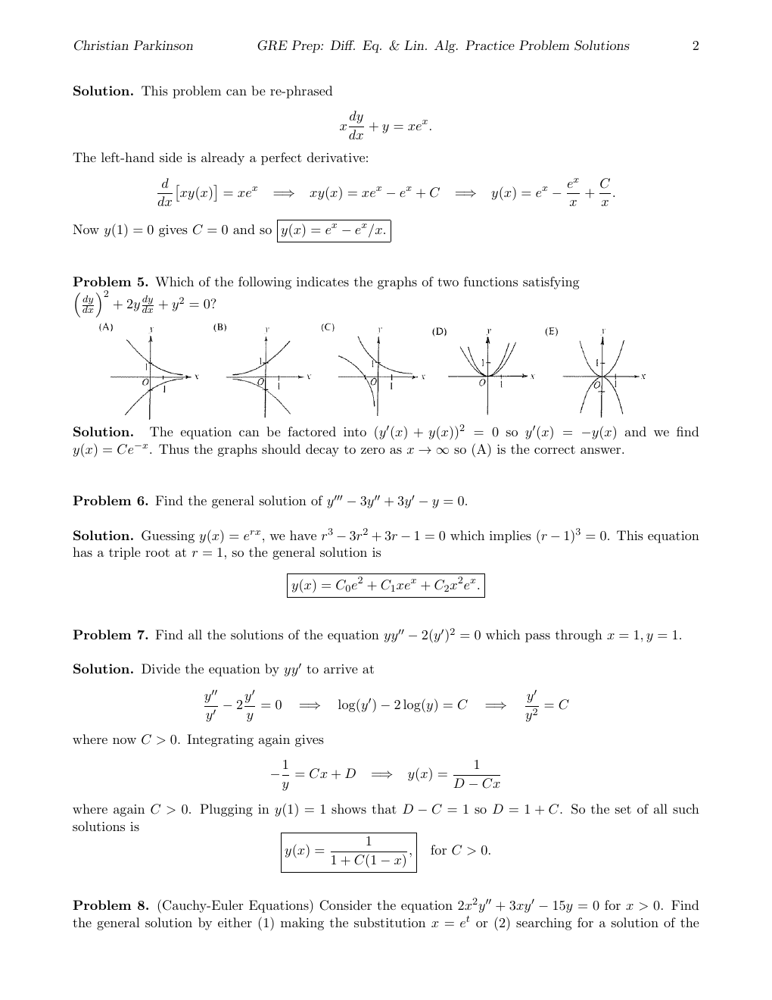

::: {.problem}
Which of the following indicates the graphs of two functions satisfying $\begin{array} { r } { \left( \frac { d y } { d x } \right) ^ { 2 } + 2 y \frac { d y } { d x } + y ^ { 2 } = 0 ? } \end{array}$

:::

::: {.solution}
The equation can be factored into $( y ^ { \prime } ( x ) + y ( x ) ) ^ { 2 } = 0 \mathrm { s o } y ^ { \prime } ( x ) = - y ( x )$ and we find $y ( x ) = C e ^ { - x }$ . Thus the graphs should decay to zero as $x \to \infty$ so $\mathrm { ( A ) }$ is the correct answer.
:::
