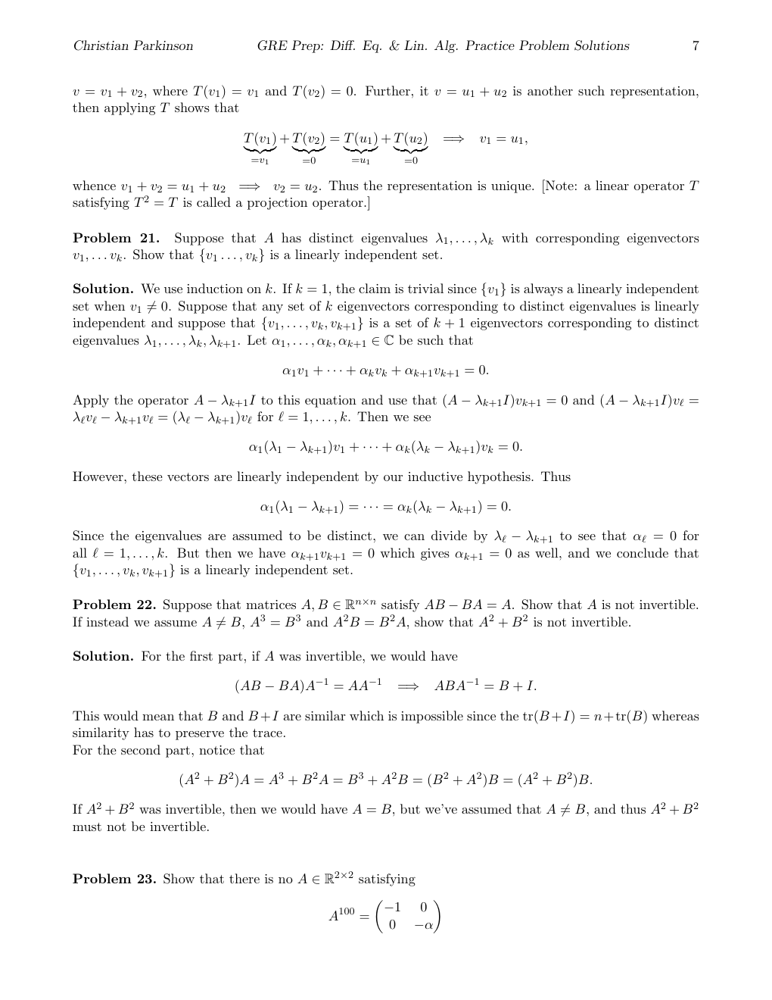

::: {.problem}
Show that there is no $A\in\mathbb R^{2\times2}$ satisfying
\[
A^{100}=\begin{pmatrix}-1&0\\0&-\alpha\end{pmatrix}
\]
when $\alpha>1$.
If $\alpha=1$, find $A\in\mathbb R^{2\times2}$ satisfying the equation.

:::

::: {.solution}
Suppose that λ is an eigenvalue of A with eigenvector v. Then we see

$$
A v = \lambda v \quad \Longrightarrow \quad A ^ { 2 } v = \lambda A v = \lambda ^ { 2 } v \quad \Longrightarrow \quad A ^ { 3 } v = \lambda ^ { 2 } A v = \lambda ^ { 3 } v \quad \Longrightarrow \quad A ^ { k } v = \lambda ^ { k } v , \quad \mathrm { f o r ~ a l l ~ } k \in \mathbb { N } .
$$

In particular the eigenvalues of $A ^ { 1 0 0 } \mathrm { ~ a r e ~ } - 1$ and −α and so $\lambda ^ { 1 0 0 } ~ < ~ 0 ~$ meaning that λ has non-zero imaginary part.
But since A has real entries (and this a real characteristic polynomial), the complex eigenvalues of A come in conjugate pairs.
Hence the eigenvalues of A are λ and λ. But then $| \lambda | = | { \overline { { \lambda } } } |$ makes it impossible that $| \lambda ^ { 1 0 0 } | = 1$ while $\left| \overline { { \lambda } } ^ { 1 0 0 } \right| = \alpha > 1$ (or vice versa).

If $\alpha = 1$ so that $A ^ { 1 0 0 } = \left( \begin{array} { c c } { { - 1 } } & { { 0 } } \\ { { 0 } } & { { - 1 } } \end{array} \right)$ . We can accomplish this with a rotation matrix.
Indeed, let

$$
A _ { \theta } = \left( { \begin{array} { c c } { \cos ( \theta ) } & { - \sin ( \theta ) } \\ { \sin ( \theta ) } & { \cos ( \theta ) } \end{array} } \right) .
$$

Then

$$
{ \begin{array} { r l } { A _ { \theta } A _ { \varphi } = { \binom { \cos ( \theta ) } { \sin ( \theta ) } } \ - \sin ( \theta ) } { \binom { \cos ( \varphi ) } { \sin ( \varphi ) } } \ - \sin ( \varphi ) } \\ { = { \binom { \cos ( \theta ) \cos ( \varphi ) - \sin ( \theta ) \sin ( \varphi ) } { \cos ( \varphi ) \sin ( \theta ) + \cos ( \theta ) \sin ( \varphi ) } } \ - ( \cos ( \theta ) \sin ( \varphi ) + \cos ( \varphi ) \sin ( \theta ) ) } \\ { = { \binom { \cos ( \varphi ) \sin ( \theta ) + \cos ( \theta ) \sin ( \varphi ) } { \cos ( \varphi ) \sin ( \theta ) + \cos ( \theta ) \sin ( \varphi ) } } \ } & { \cos ( \theta ) \cos ( \varphi ) - \sin ( \theta ) \sin ( \varphi ) } \end{array} 
$$

And now remembering that $\cos ( a + b ) = \cos ( a ) \cos ( b ) - \sin ( a ) \sin ( b )$ and $\sin ( a + b ) = \cos ( a ) \sin ( b ) +$ $\cos ( b ) \sin ( a )$ , we have

$$
A _ { \theta } A _ { \varphi } = { \binom { \cos ( \theta + \varphi ) } { \sin ( \theta + \varphi ) } } \quad - \sin ( \theta + \varphi ) \biggr ) = A _ { \theta + \varphi } .
$$

Now put $\theta = \pi / 1 0 0$ . Then

$$
A _ { \theta } ^ { 1 0 0 } = A _ { 1 0 0 \theta } = A _ { \pi } = \left( \begin{array} { r r } { { - 1 } } & { { 0 } } \\ { { 0 } } & { { - 1 } } \end{array} \right) .
$$
:::
