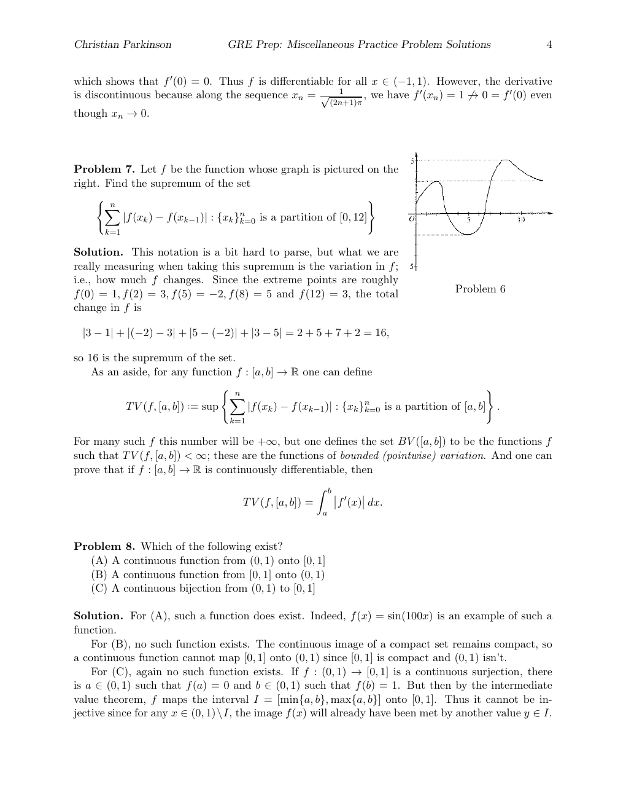

::: {.problem}
Let $f$ be the function whose graph is pictured on the right.
Find the supremum of the set

$$
\left\{ \sum _ { k = 1 } ^ { n } \left| f ( x _ { k } ) - f ( x _ { k - 1 } ) \right| : \left\{ x _ { k } \right\} _ { k = 0 } ^ { n } { \mathrm { ~ i s ~ a ~ p a r t i t i o n ~ o f ~ } } [ 0 , 1 2 ] \right\}
$$

:::

::: {.solution}
This notation is a bit hard to parse, but what we are really measuring when taking this supremum is the variation in $f ;$ i.e., how much f changes.
Since the extreme points are roughly $f ( 0 ) = 1 , f ( 2 ) = 3 , f ( 5 ) = - 2 , f ( 8 ) = 5$ and $f ( 1 2 ) = 3$ , the total change in $f$ is

Problem 6

$$
| 3 - 1 | + | ( - 2 ) - 3 | + | 5 - ( - 2 ) | + | 3 - 5 | = 2 + 5 + 7 + 2 = 1 6 ,
$$

so 16 is the supremum of the set.

As an aside, for any function $f : [ a , b ]  \mathbb { R }$ one can define

$$
T V ( f , [ a , b ] ) : = \operatorname* { s u p } \left\{ \sum _ { k = 1 } ^ { n } | f ( x _ { k } ) - f ( x _ { k - 1 } ) | : \{ x _ { k } \} _ { k = 0 } ^ { n } { \mathrm { ~ i s ~ a ~ p a r t i t i o n ~ o f ~ } } [ a , b ] \right\} .
$$

For many such f this number will be $+ \infty$ , but one defines the set $B V ( [ a , b ] )$ to be the functions $f$ such that $T V ( f , [ a , b ] ) < \infty ;$ these are the functions of bounded (pointwise) variation.
And one can prove that if $f : [ a , b ]  \mathbb { R }$ is continuously differentiable, then

$$
T V ( f , [ a , b ] ) = \int _ { a } ^ { b } \left| f ^ { \prime } ( x ) \right| d x .
$$
:::
