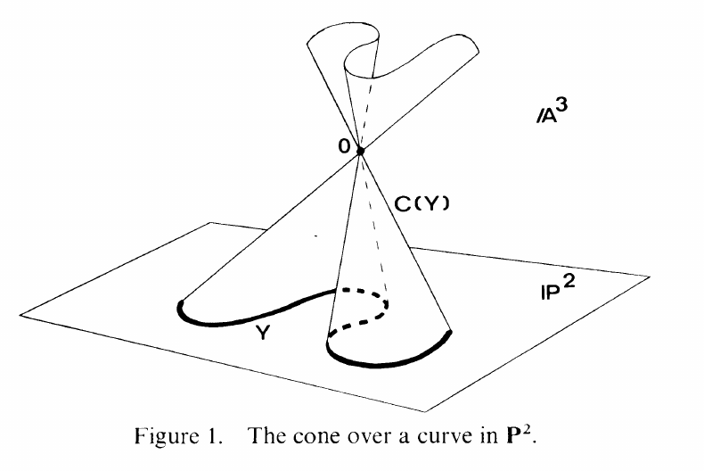

::: problem
Let $Y \subseteq \PP^n$ be a nonempty algebraic set, and let $\theta: \AA^{n+1} \sm \ts{(0,\ldots,0)} \to \PP^n$ send the point with affine coordinates $(a_0,\ldots,a_n)$ to the point with homogeneous coordinates $\tv{a_0 : \cdots : a_n}$.
The **affine cone** over $Y$ is
\[
C(Y) = \theta\inv(Y) \union \ts{(0,\ldots,0)} .
\]

1. Show that $C(Y)$ is an algebraic set in $\AA^{n+1}$ whose ideal equals $I(Y)$, regarded as an ordinary ideal of $k[x_0,\ldots,x_n]$.

2. Show that $C(Y)$ is irreducible if and only if $Y$ is.

3. Show that $\dim C(Y) = \dim Y + 1$.

The projective closure $\overline{C(Y)}$ in $\PP^{n+1}$ is called the **projective cone** over $Y$.

{width=400px}
:::

::: solution
**Part 1.** The set $C(Y)$ is algebraic because it is of the form $C(Y) = V(I(Y))$.
That the ideal is again $I(Y)$: a polynomial $f$ vanishing on $C(Y)$ vanishes at every $\vector{a} \neq \vector{0}$ of the cone, and reading $\vector{a}$ as homogeneous coordinates on $\PP^n$ shows $f$ vanishes on $Y$.
Conversely, if $f \in I(Y)$ is homogeneous then $f(\lambda \vector{a}) = \lambda^{\deg f} f(\vector{a}) = 0$, so $f$ vanishes on $C(Y) \sm \ts{\vector{0}}$, and any homogeneous polynomial of positive degree vanishes at $\vector{0}$ as well.

**Part 2.** An algebraic set is irreducible exactly when its ideal is prime, and by part 1 the two ideals coincide: $I(Y) = I(C(Y))$.

**Part 3.** Using the previous exercise,
\[
\dim C(Y) = \dim S(C(Y)) = \dim S(Y) = \dim Y + 1 .
\]
:::
