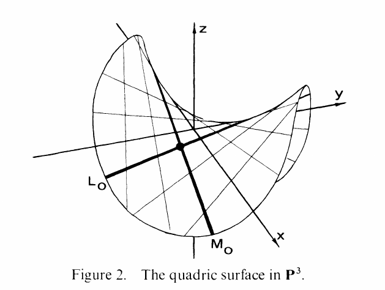

::: {.problem}
Consider the surface $Q$ in $\PP^3$ defined by $xy - zw = 0$; a **surface** is a variety of dimension $2$.

1. Show that $Q$ is the Segre embedding of $\PP^1 \times \PP^1$ in $\PP^3$, for a suitable choice of coordinates.

2. Show that $Q$ contains two families of lines $\ts{L_t}$ and $\ts{M_t}$, each parametrized by $t \in \PP^1$, with these properties: if $L_t \neq L_u$ then $L_t \intersect L_u = \emptyset$; if $M_t \neq M_u$ then $M_t \intersect M_u = \emptyset$; and $L_t \intersect M_u$ is a single point for all $t, u$.
   A **line** is a linear variety of dimension $1$.

3. Show that $Q$ contains curves other than these lines, and deduce that the Zariski topology on $Q$ is not carried by $\psi$ to the product topology on $\PP^1 \times \PP^1$, where each factor has its Zariski topology.

{width=350px}
:::
