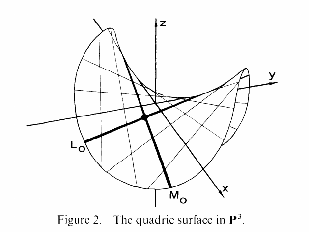

::: {.problem}
Let $k$ be algebraically closed.
Consider the surface $Q$ in $\PP^3$ defined by $xy - zw = 0$; a **surface** is a variety of dimension $2$.

(a) Show that $Q$ is the Segre embedding of $\PP^1 \times \PP^1$ in $\PP^3$, for a suitable choice of coordinates.

(b) Show that $Q$ contains two families of lines $\theset{L_t}$ and $\theset{M_t}$, each parametrized by $t \in \PP^1$, with these properties: if $L_t \neq L_u$ then $L_t \intersect L_u = \emptyset$; if $M_t \neq M_u$ then $M_t \intersect M_u = \emptyset$; and $L_t \intersect M_u$ is a single point for all $t, u$.
A **line** is a linear variety of dimension $1$.

(c) Show that $Q$ contains curves other than these lines, and deduce that the Zariski topology on $Q$ is not carried by $\psi$ to the product topology on $\PP^1 \times \PP^1$, where each factor has its Zariski topology.

{width=350px}
:::

::: {.solution}
Use the coordinate order $[x:y:z:w]$ on $\PP^3$ and the reordered Segre map
$$
\psi([a:b],[c:d])=[ac:bd:ad:bc].
$$
The topology in (c) is the topology on the classical sets of projective points over $k$.

::: pf

::: {.pf-step #image-of-psi-is-q}
The image of $\psi$ is exactly $Q$.

::: pf-proof
Substituting the four coordinates gives $(ac)(bd)-(ad)(bc)=0$, so the image lies in $Q$.
Conversely, a point $[x:y:z:w]$ of $Q$ defines a nonzero matrix
$$
\begin{pmatrix}x&z\\w&y\end{pmatrix}
$$
whose determinant is zero.
The nonzero-entry calculation in [[P-AGH214SEGRE]], step 2, expresses this matrix as a nonzero column $(a,b)^t$ times a nonzero row $(c,d)$.
It therefore has the four coordinates displayed for $\psi$.
Step 3 of that card proves uniqueness of the two projective factors, so $\psi$ is a bijection onto $Q$.
Its image is a projective variety by the same card.
The chart $x\ne0$ on $Q$ has coordinates $z/x,w/x$, with $y/x=(z/x)(w/x)$, and is an affine plane.
The other nonzero-entry charts have the same form, so $\dim Q=2$ by [[P-AGH27DIMPN]], step 1.
This proves (a).
:::

:::

::: {.pf-step #ruling-lines-construction}
The ruling lines in (b) are
$$
\boxed{L_{[a:b]}=\{[ac:bd:ad:bc]:[c:d]\in\PP^1\},\qquad
M_{[c:d]}=\{[ac:bd:ad:bc]:[a:b]\in\PP^1\}.}
$$

::: pf-proof
For fixed $[a:b]$, the vectors in the first parametrization have the form
$$
c(a,0,0,b)+d(0,b,a,0).
$$
The two displayed vectors are linearly independent, since $(a,b)\ne(0,0)$ and their nonzero coordinates lie in disjoint pairs of positions.
Their projectivized span is consequently a line by [[P-AGH211LINEAR]].
Similarly, for fixed $[c:d]$, the second parametrization is the projectivized span of the independent vectors $(c,0,d,0)$ and $(0,d,0,c)$.
All these lines lie in $Q$ by step {.pf-ref}.

Under the bijection $\psi$, the first family is the image of the subsets $\{t\}\times\PP^1$, and the second is the image of $\PP^1\times\{u\}$.
Two distinct members of either family are therefore disjoint.
For every $t,u$, their intersection is precisely the one point $\psi(t,u)$.
This also proves that each family is parametrized without repetition by $\PP^1$.
:::

:::

::: {.pf-step #diagonal-curve-not-a-line}
The closed curve
$$
C=Q\cap Z(z-w)=\{[a^2:b^2:ab:ab]:[a:b]\in\PP^1\}
$$
is not a line.

::: pf-proof
In the coordinates of $\psi$, the extra equation $z=w$ is $ad=bc$.
For nonzero two-dimensional vectors, this determinant equation is equivalent to $[a:b]=[c:d]$.
Thus $C$ is precisely the image under $\psi$ of the diagonal of the set $\PP^1\times\PP^1$.
Its displayed parametrization is the quadratic Veronese embedding of $\PP^1$ in the plane $z=w$, by [[P-AGH212DUPLE]].
It is therefore a closed irreducible curve.
It contains the points
$$
[1:0:0:0],\qquad[0:1:0:0],\qquad[1:1:1:1],
$$
whose representative vectors are linearly independent.
A projective line is the projectivization of a two-dimensional vector space, so it cannot contain these three points.
Hence $C$ is a curve other than either ruling line, in every characteristic.
:::

:::

::: {.pf-step #product-topology-not-homeomorphism}
The product topology in (c) does not make $\psi$ a homeomorphism onto $Q$.

::: pf-proof
Every proper Zariski-closed subset of $\PP_k^1$ is finite.
Indeed, it is contained in the zero set of a nonzero homogeneous polynomial, whose zeros on either affine chart are zeros of a nonzero one-variable polynomial, apart from a possible missing endpoint.
Conversely, every finite subset is closed because points are closed.
The field $k$ is infinite, so the set of projective points is infinite and this topology is the cofinite topology.

Let $\Delta=\{(t,t):t\in\PP^1\}$.
Every nonempty basic open rectangle $A\times B$ in the product topology meets $\Delta$: both $A$ and $B$ have finite complement, so $A\cap B\ne\varnothing$.
Thus $\Delta$ is dense in the product topology.
It is a proper subset, since there are distinct projective points, and hence is not closed.

But step {.pf-ref} gives $\psi^{-1}(C)=\Delta$, whereas $C$ is Zariski-closed in $Q$.
Therefore $\psi$ from the product-topological space to $Q$ is not even continuous, and in particular is not a homeomorphism.
This proves (c).
:::

:::

::: pf-qed
Step {.pf-ref} proves (a), step {.pf-ref} proves (b), and steps {.pf-ref} and {.pf-ref} prove both assertions in (c).
:::

:::

:::
