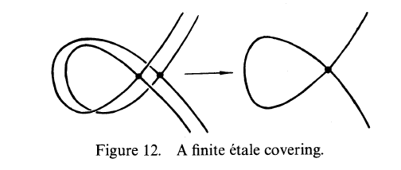

::: problem
Let $Y$ be the plane nodal cubic curve $y^2 = x^2(x+1)$.
Show that $Y$ has a finite étale covering $X$ of degree $2$, where $X$ is a union of two irreducible components, each one isomorphic to the normalization of $Y$.

{width=350px}
:::
