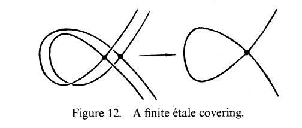

::: {.problem}
Let $Y$ be the plane nodal cubic curve $y^2 = x^2(x+1)$.
Show that $Y$ has a finite étale covering $X$ of degree $2$, where $X$ is a union of two irreducible components, each one isomorphic to the normalization of $Y$.

{width=350px}
:::

::: {.solution}
Let $N=(0,0)$ be the singular point of the affine cubic.
Because the curve is assumed nodal, we are in characteristic different from
$2$; in characteristic $2$ the tangent cone is $(y-x)^2$ and the displayed
curve is not nodal [[P-AGH44RATCURVES]].

::: pf

::: {.pf-step #s1}

The normalization of $Y$ is $\PP_v^1$, and the two points above $N$ are
$$
p=(v=1),
\qquad
q=(v=-1).
$$

::: pf-proof

On the affine chart of $Y$ containing the node, put
$$
v=\frac yx.
$$
Then
$$
v^2=x+1,
$$
so
$$
x=v^2-1,
\qquad
y=v(v^2-1).
$$
Thus the normalization map is the parametrization
$$
\nu:\PP_v^1\longrightarrow Y
$$
recorded in [[P-AGH44RATCURVES]].
The node $x=y=0$ has preimages $v=1$ and $v=-1$, which are distinct because
$\operatorname{char}k\ne2$.
Away from these two points, $\nu$ is an isomorphism onto $Y\setminus\{N\}$.

:::

:::

::: {.pf-step #s2}

On the affine nodal chart, the coordinate ring of $Y$ is
$$
A=k+(v^2-1)k[v]\subseteq B=k[v].
$$

::: pf-proof

The parametrization of step {.pf-ref} identifies
$$
A=k[v^2-1,\,v(v^2-1)].
$$
Every element of this subring is a polynomial whose values at $v=1$ and
$v=-1$ agree. Conversely, if $F\in k[v]$ satisfies $F(1)=F(-1)$, then
$F-F(1)$ is divisible by $(v-1)(v+1)=v^2-1$, so
$$
F\in k+(v^2-1)k[v].
$$
Hence
$$
\boxed{A=\{F\in B:F(1)=F(-1)\}}.
$$
This is also the branch-gluing description used in
[[P-AGH2713NONPROJ]].

:::

:::

::: {.pf-step #s3}

Define an affine curve over the nodal chart by
$$
C=left\{
(F,G)\in B\oplus B:
F(1)=G(-1),\quad F(-1)=G(1)
\right\}.
$$
Then $\Spec C$ has two irreducible components, each with normalization $\AA^1$, and those components meet transversely in two points.

::: pf-proof

The normalization of $C$ is $B\oplus B$, hence consists of two affine lines.
The defining equalities identify the branch $v=1$ on the first line with the
branch $v=-1$ on the second, and independently identify the branch $v=-1$ on
the first with the branch $v=1$ on the second.

Put
$$
J=(v^2-1)B.
$$
Modulo $J\oplus J$, the ring $C$ becomes
$$
C/(J\oplus J)\cong k\oplus k,
$$
the two factors recording the two common branch values. Hence there are
exactly two points where the two normalization components are glued.

At either such point, the completed local ring is the ordinary node
$$
k[[s,t]]/(st),
$$
because it is obtained by gluing two smooth formal branches along their common
residue field. Thus the two components meet transversely at both points.

:::

:::

::: {.pf-step #s4}

The diagonal homomorphism
$$
A\longrightarrow C,
\qquad
H\longmapsto(H,H),
$$
defines a finite morphism of degree two over the nodal chart.

::: pf-proof

If $H\in A$, step {.pf-ref} gives $H(1)=H(-1)$, so $(H,H)$ satisfies both crossed
equalities and lies in $C$.

The normalization ring $B$ is finite over $A$: the element $v$ is integral,
since
$$
v^2=x+1\in A.
$$
Therefore $B\oplus B$ is a finite $A$-module. The ring $A$ is noetherian, so
its submodule $C\subseteq B\oplus B$ is finite as well. Hence
$$
\Spec C\longrightarrow\Spec A
$$
is finite.

After inverting $v^2-1$, the normalization is already an isomorphism with the
smooth locus of $Y$, and the crossed conditions disappear. Thus away from the
node the map is simply
$$
(Y\setminus\{N\})\sqcup(Y\setminus\{N\})
\longrightarrow
Y\setminus\{N\}.
$$
It therefore has degree two.

:::

:::

::: {.pf-step #s5}

Gluing with two copies of the smooth locus produces a curve $X$ whose two irreducible components are each isomorphic to $\PP^1$, together with a finite morphism
$$
f:X\longrightarrow Y.
$$

::: pf-proof

Let
$$
V=Y\setminus\{N\}.
$$
Over the overlap of the affine nodal chart with $V$, step {.pf-ref} identifies
$\Spec C$ with two disjoint copies of that overlap.
Glue $\Spec C$ to
$$
V\sqcup V
$$
by these two identifications. The resulting curve $X$ carries a morphism to
$Y$ which is the map of step {.pf-ref} near the node and the identity on each copy
of $V$ away from the node. Finiteness is local on the target, so $f$ is finite.
Since $Y$ is projective and a finite morphism is projective, $X$ is projective
as well.

The normalization of $X$ is the disjoint union of two copies of $\PP^1$.
In the crossed gluing, the two points on either one copy are sent to the two
different nodes of $X$; no two points on the same copy are identified.
Consequently each copy maps isomorphically onto an irreducible component of
$X$. Thus
$$
X=X_1\cup X_2,
\qquad
X_1\cong X_2\cong\PP^1,
$$
and the two components meet at exactly the two nodes described in step {.pf-ref}.
Each $X_i$ is therefore isomorphic to the normalization of $Y$.

:::

:::

::: {.pf-step #s6}

The morphism $f$ is étale at the two points lying above $N$.

::: pf-proof

Let $r$ be one of the two nodes of $X$ over $N$.
The completed local ring of the ordinary node $N\in Y$ is
$$
\widehat\OO_{Y,N}\cong k[[s,t]]/(st).
$$
By step {.pf-ref} the completed local ring at $r$ is the same:
$$
\widehat\OO_{X,r}\cong k[[s,t]]/(st).
$$
Under the map induced by $f$, the two formal branches of $Y$ are carried to
the two branches meeting at $r$; the crossed construction merely chooses
which normalization component supplies each branch. Hence
$$
\widehat\OO_{Y,N}\xrightarrow{\sim}\widehat\OO_{X,r}.
$$
The residue-field map is the identity on $k$.

Therefore the completed-local-ring criterion of
[[P-AGH3104ETALECOMPL|Exercise III.10.4]] shows that $f$ is étale at $r$.
The identical argument applies to the other point above $N$.

:::

:::

::: {.pf-step #s7}

The morphism $f$ is a finite étale cover of degree two.

::: pf-proof

Away from $N$, step {.pf-ref} identifies $f$ with the disjoint union of two
identity maps, so it is étale there. Step {.pf-ref} proves étaleness at the two
remaining points of $X$. Hence $f$ is étale everywhere.

It is finite by step {.pf-ref}. A finite étale morphism is finite locally free, and
its rank is locally constant on the base. The curve $Y$ is irreducible, hence
connected. Over the nonempty open subset $Y\setminus\{N\}$, step {.pf-ref} shows
that the rank is two. Therefore the rank is two everywhere:
$$
\boxed{2}.
$$
So $f:X\to Y$ is the required finite étale covering of degree two.

:::

:::

::: pf-qed

Steps {.pf-ref}, {.pf-ref}, {.pf-ref}, {.pf-ref} and {.pf-ref} construct the crossed two-component cover, and steps
{.pf-ref} and {.pf-ref} prove that it is finite étale of degree two with each irreducible
component isomorphic to the normalization of $Y$.

:::

:::

:::
