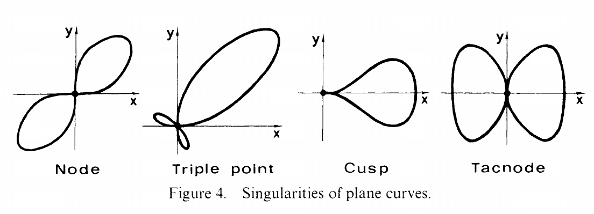

::: {.problem}
Assume $\operatorname{char} k \neq 2$.
Locate the singular points of the following curves in $\AA^2$ and sketch each curve.

1. $x^2 = x^4 + y^4$

2. $xy = x^6 + y^6$

3. $x^3 = y^2 + x^4 + y^4$

4. $x^2 y + x y^2 = x^4 + y^4$

Which is which in the figure?

{width=550px}
:::

::: {.solution}
For a plane curve $f(x,y)=0$, a point is singular exactly when
$$
f=f_x=f_y=0
$$
at that point [@Har10a, Chapter I, §5].
The lowest-degree nonzero homogeneous part of the translated equation is the tangent cone; its linear factors give the tangent directions.

::: pf

::: {.pf-step #s1}
For
$$
f_1=x^2-x^4-y^4,
$$
the only singular point is $(0,0)$.

::: pf-proof
The partial derivatives are
$$
(f_1)_x=2x-4x^3=2x(1-2x^2),\qquad
(f_1)_y=-4y^3.
$$
Since $\operatorname{char}k\ne2$, the second equation forces $y=0$.
Then $f_1=0$ gives $x^2(1-x^2)=0$.
If $x^2=1$, then $(f_1)_x=-2x\ne0$; hence a singular point must have $x=0$.
Thus the origin is the unique singular point.

The tangent cone there is $x^2$, a double tangent line $x=0$.
Moreover the equation has two formal branches
$$
x=\pm y^2+\text{terms of higher order},
$$
because $x^2(1-x^2)=y^4$ and $1-x^2$ has a square root with constant term $1$ in the completed local ring.
The two smooth branches have the same tangent.
Thus the origin is a tacnode.
:::

:::

::: {.pf-step #s2}
For
$$
f_2=xy-x^6-y^6,
$$
the only singular point is $(0,0)$, and it is a node.

::: pf-proof
One has
$$
(f_2)_x=y-6x^5,\qquad (f_2)_y=x-6y^5.
$$
At a singular point,
$$
x(f_2)_x+y(f_2)_y
=2xy-6(x^6+y^6).
$$
Using $f_2=0$, so that $xy=x^6+y^6$, this becomes
$$
-4(x^6+y^6)=0.
$$
Because $\operatorname{char}k\ne2$, it follows that $x^6+y^6=0$, hence $xy=0$.
If $x=0$, the equation $x^6+y^6=0$ gives $y=0$, and similarly if $y=0$.
Thus the origin is the only singular point.

The tangent cone is $xy$, the union of the two distinct lines $x=0$ and $y=0$.
Hence the singularity is an ordinary double point, or node.
:::

:::

::: {.pf-step #s3}
For
$$
f_3=x^3-y^2-x^4-y^4,
$$
the origin is always singular; if $\operatorname{char}k\notin\{7,13\}$ it is the only singular point, while in characteristics $7$ and $13$ there are exactly two further singular points
$$
\boxed{\left(\frac34,\ \pm\sqrt{-\frac12}\right).}
$$

::: pf-proof
The derivatives are
$$
(f_3)_x=x^2(3-4x),\qquad
(f_3)_y=-2y(1+2y^2).
$$
Thus a singular point must satisfy
$$
x=0\ \text{or}\ x=\frac34,
\qquad
y=0\ \text{or}\ y^2=-\frac12.
$$
If $x=0$, substitution in $f_3$ shows that the second alternative for $y$ gives
$$
-y^2-y^4=\frac14\ne0,
$$
so $y=0$.
If $y=0$, the alternative $x=3/4$ gives
$$
x^3-x^4=\frac{27}{256},
$$
which is nonzero unless $\operatorname{char}k=3$; in characteristic $3$, however, $3/4=0$, so this is again the origin.

For the remaining possibility,
$$
x=\frac34,\qquad y^2=-\frac12,
$$
direct substitution gives
$$
f_3=\frac{27}{256}+\frac14=\frac{91}{256}.
$$
Since the characteristic is not $2$, this vanishes exactly in characteristics $7$ and $13$.
In either of those characteristics $-1/2\ne0$, so algebraic closedness gives two distinct square roots and hence exactly two additional singular points.

At the origin the tangent cone is $-y^2$, a double tangent $y=0$, while the first term involving $x$ is $x^3$.
This is the standard cusp type $y^2=x^3$ up to higher-order terms.
Thus the origin is the cusp shown in the source figure.
:::

:::

::: {.pf-step #s4}
For
$$
f_4=x^2y+xy^2-x^4-y^4,
$$
the only singular point is $(0,0)$, and it is an ordinary triple point.

::: pf-proof
The derivatives are
$$
(f_4)_x=2xy+y^2-4x^3,\qquad
(f_4)_y=x^2+2xy-4y^3.
$$
At a singular point,
$$
x(f_4)_x+y(f_4)_y
=3xy(x+y)-4(x^4+y^4).
$$
The equation $f_4=0$ gives $xy(x+y)=x^4+y^4$, so the preceding equality becomes
$$
-(x^4+y^4)=0.
$$
Hence $x^4+y^4=0$ and also $xy(x+y)=0$.
If $x=0$ or $y=0$, the first equality forces the other coordinate to be zero.
If $x+y=0$, then $x^4+y^4=2x^4=0$, and $\operatorname{char}k\ne2$ again gives $x=y=0$.
Thus the origin is the only singular point.

Its tangent cone is
$$
x^2y+xy^2=xy(x+y),
$$
the union of three distinct lines.
Therefore the origin is an ordinary triple point.
:::

:::

::: {.pf-step #s5}
The four origin singularities in the figure are, respectively,
$$
\boxed{\text{(1) tacnode,\quad (2) node,\quad (3) cusp,\quad (4) ordinary triple point}.}
$$

::: pf-proof
This is exactly the tangent-cone and branch analysis in steps {.pf-ref}, {.pf-ref}, {.pf-ref}, and {.pf-ref}.
The displayed source figure represents the characteristic-zero, equivalently the generic-characteristic, picture.
In characteristics $7$ and $13$, part (3) has the two additional singular points found in step {.pf-ref}, so that figure does not depict the entire singular locus under only the source's stated assumption $\operatorname{char}k\ne2$.
:::

:::

::: pf-qed
Steps {.pf-ref}, {.pf-ref}, {.pf-ref}, and {.pf-ref} locate every singular point and identify the local shapes at the origin; step {.pf-ref} matches them with the four sketches.
:::

:::
:::

::: {.remark title="Characteristic exceptions in part (3)"}
The source assumes only $\operatorname{char}k\ne2$.
That hypothesis is sufficient for parts (1), (2), and (4), but part (3) acquires the two additional singular points displayed in step {.pf-ref} when $\operatorname{char}k=7$ or $13$.
Thus the four-singularity picture is literally correct, without further points, for characteristic zero and for $\operatorname{char}k\notin\{2,7,13\}$.
:::
