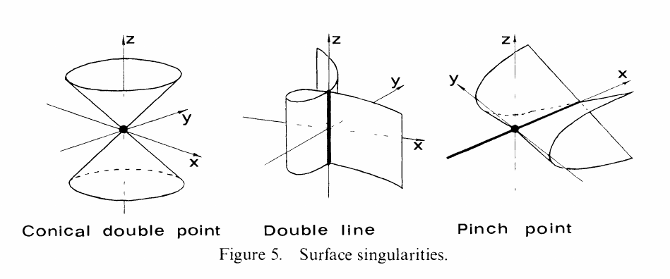

::: problem
Assume $\operatorname{char} k \neq 2$.
Locate the singular points and describe the singularities of the following surfaces in $\AA^3$.

1. $x y^2 = z^2$

2. $x^2 + y^2 = z^2$

3. $xy + x^3 + y^3 = 0$

Which is which in the figure?

{width=550px}
:::
