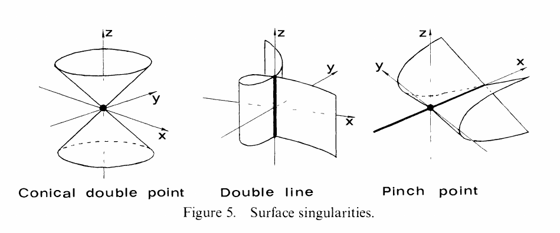

::: {.problem}
Assume $\operatorname{char} k \neq 2$.
Locate the singular points and describe the singularities of the following surfaces in $\AA^3$.

1. $x y^2 = z^2$

2. $x^2 + y^2 = z^2$

3. $xy + x^3 + y^3 = 0$

Which is which in the figure?

{width=550px}
:::

::: {.solution}
For a hypersurface $f=0$ in $\AA^3$, a point is singular exactly when
$$
f=f_x=f_y=f_z=0
$$
there [@Har10a, Chapter I, §5].

::: pf

::: {.pf-step #surface-one-singular-line}
For the surface
$$
S_1=V(xy^2-z^2),
$$
the singular locus is the line
$$
\boxed{\Sing(S_1)=V(y,z)=\{(x,0,0):x\in k\}.}
$$

::: pf-proof
Put $f_1=xy^2-z^2$.
Then
$$
(f_1)_x=y^2,\qquad
(f_1)_y=2xy,\qquad
(f_1)_z=-2z.
$$
Since $\operatorname{char}k\ne2$, simultaneous vanishing forces $y=z=0$, while $x$ is arbitrary.
Every such point also satisfies $f_1=0$.
Hence the displayed line is exactly the singular locus.

At a point $(a,0,0)$ with $a\ne0$, write $x=a+u$.
The quadratic part transverse to the singular line is
$$
ay^2-z^2,
$$
which factors into two distinct linear forms over the algebraically closed field.
Thus away from the origin the surface consists locally of two smooth sheets crossing transversely along the singular line.

At the origin the quadratic part degenerates to $-z^2$, while the next term is $xy^2$.
Equivalently the equation is
$$
z^2=xy^2,
$$
the standard pinch-point, or Whitney-umbrella, form after relabelling coordinates.
The two transverse sheets along the punctured singular line coalesce at the origin.
:::

:::

::: {.pf-step #surface-two-conical-point}
For
$$
S_2=V(x^2+y^2-z^2),
$$
the unique singular point is the origin, and it is a conical double point.

::: pf-proof
For $f_2=x^2+y^2-z^2$,
$$
(f_2)_x=2x,\qquad
(f_2)_y=2y,\qquad
(f_2)_z=-2z.
$$
Since $2$ is invertible, the three derivatives vanish simultaneously only at $(0,0,0)$.
The equation is already homogeneous quadratic, so the surface is its own tangent cone at the origin.
The quadratic form is nondegenerate: its associated diagonal matrix has nonzero determinant because $\operatorname{char}k\ne2$.
Thus the origin is an isolated ordinary quadratic, or conical double, point.
:::

:::

::: {.pf-step #surface-three-double-line}
For
$$
S_3=V(xy+x^3+y^3),
$$
the singular locus is the $z$-axis
$$
\boxed{\Sing(S_3)=V(x,y)=\{(0,0,z):z\in k\}.}
$$

::: pf-proof
Put $g(x,y)=xy+x^3+y^3$, so $S_3=V(g)\times\AA_z^1$.
The derivatives are
$$
g_x=y+3x^2,\qquad g_y=x+3y^2.
$$
At a singular point of the plane curve $g=0$,
$$
xg_x+yg_y=2xy+3x^3+3y^3.
$$
Using $xy=-(x^3+y^3)$ from $g=0$, this becomes
$$
x^3+y^3=0.
$$
The curve equation then gives $xy=0$.
If $x=0$, the first equality gives $y=0$, and similarly if $y=0$.
Thus the plane curve has only the singular point $(0,0)$; this argument also covers characteristic $3$.
Because $g$ is independent of $z$, every point $(0,0,z)$ and no other point is singular on the surface.

The tangent cone of $g$ at the origin is $xy$, two distinct transverse lines.
Hence the plane curve has a node there, and
$$
S_3=(\text{nodal plane curve})\times\AA^1.
$$
Locally its two smooth surface branches meet transversely along the entire $z$-axis.
This is the double-line singularity shown in the figure.
:::

:::

::: {.pf-step #match-figure}
The three surfaces in the figure are, respectively,
$$
\boxed{\text{(1) pinch point,\qquad (2) conical double point,\qquad (3) double line}.}
$$

::: pf-proof
Step {.pf-ref} identifies the Whitney-umbrella degeneration at the distinguished point of the singular line.
Step {.pf-ref} gives the isolated quadratic cone.
Step {.pf-ref} gives two surface branches crossing along a line.
These are exactly the three depicted local models.
:::

:::

::: pf-qed
Steps {.pf-ref}, {.pf-ref} and {.pf-ref} locate and describe all singular points, and step {.pf-ref} matches the equations with the source figure.
:::

:::
:::
