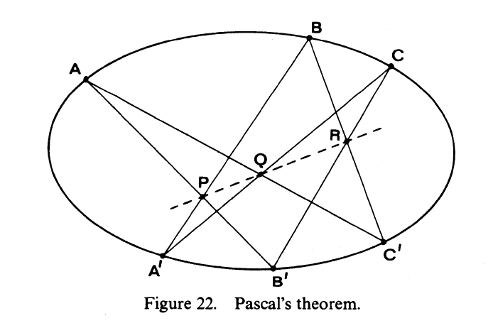

::: {.problem}
Prove Pascal's theorem: if $A, B, C, A^{\prime}, B^{\prime}, C^{\prime}$ are any six points on a conic, then the points $P=A B^{\prime} \cdot A^{\prime} B$, $Q=A C^{\prime} \cdot A^{\prime} C$, and $R=B C^{\prime} \cdot B^{\prime} C$ are collinear.

{width=350px}
:::

::: {.solution}
Let
$$
K\subseteq\PP^2
$$
be the conic containing
$$
A,B,C,A',B',C'.
$$
We first treat the open configuration in which the six points are distinct
and all the side intersections in the statement are distinct and
well-defined.

::: pf

::: {.pf-step #nine-intersection-points}
Form the two reducible cubics
$$
X=AB'\cup BC'\cup CA'
$$
and
$$
Y=A'B\cup B'C\cup C'A.
$$
Their nine pairwise line intersections are exactly
$$
A,B,C,A',B',C',P,Q,R.
$$

::: pf-proof
Write the three components of $X$ as rows and those of $Y$ as columns. Their
pairwise intersections are
$$
\begin{array}{c|ccc}
 & A'B & B'C & C'A\\ \hline
AB' & P & B' & A\\
BC' & B & R & C'\\
CA' & A' & C & Q.
\end{array}
$$
Indeed, for example,
$$
AB'\cap A'B=P,
\qquad
BC'\cap B'C=R,
\qquad
CA'\cap C'A=Q,
$$
by the definitions in the problem; the remaining six intersections are the
six named points on $K$.

For a general such configuration the two cubics have no common line
component. Hence Bezout gives
$$
\deg(X\cap Y)=3\cdot3=9,
$$
and the table lists all nine points of their complete intersection.
:::

:::

::: {.pf-step #eight-points-on-conic-union-line}
The reducible cubic
$$
Z=K\cup PQ
$$
contains eight of the nine points of $X\cap Y$:
$$
A,B,C,A',B',C',P,Q.
$$

::: pf-proof
The first six points lie on the conic $K$ by hypothesis, while $P$ and $Q$
lie on the line $PQ$ by definition. Thus all eight lie on the cubic
$K\cup PQ$.
:::

:::

::: {.pf-step #r-lies-on-z}
The ninth point $R$ lies on $Z$.

::: pf-proof
Apply the Cayley--Bacharach theorem to the complete intersection of the two
cubics $X$ and $Y$. Any cubic through eight of the nine intersection points
passes through the ninth. By step {.pf-ref}, $Z$ passes through eight of them.
Therefore
$$
R\in Z=K\cup PQ.
$$
:::

:::

::: {.pf-step #r-not-on-conic}
In the nondegenerate configuration,
$$
R\notin K.
$$

::: pf-proof
By definition,
$$
R\in BC'.
$$
The line $BC'$ already meets the conic $K$ at the two distinct points
$$
B
\qquad\text{and}\qquad
C'.
$$
If $R$ were a third distinct point of $BC'\cap K$, then a line and a conic
would have at least three distinct intersection points, contradicting
Bezout. In the present open configuration $R$ is distinct from $B,C'$, so
indeed $R\notin K$.
:::

:::

::: {.pf-step #pqr-collinear-nondegenerate}
Therefore
$$
\boxed{P,Q,R\text{ are collinear}.}
$$

::: pf-proof
Step {.pf-ref} gives
$$
R\in K\cup PQ,
$$
while step {.pf-ref} excludes the conic component. Hence
$$
R\in PQ.
$$
This is precisely Pascal's collinearity assertion for the nondegenerate
configuration.
:::

:::

::: {.pf-step #extends-to-degenerate-case}
The same collinearity holds for every specialization for which the
three points $P,Q,R$ in the statement are defined.

::: pf-proof
The construction is algebraic in the six points. On any affine coordinate
chart, the intersection point of two distinct lines is given by their cross
product, so homogeneous coordinates of $P,Q,R$ are polynomial expressions
in homogeneous coordinates of
$$
A,B,C,A',B',C'.
$$
Collinearity is the vanishing of the determinant
$$
\det(P,Q,R).
$$
After substituting those cross-product expressions, this determinant is a
multihomogeneous polynomial in the coordinates of the six points. For a
fixed nonsingular conic $K$, the parameter space
$$
K^6
$$
is irreducible, and the nondegenerate configurations used in steps
{.pf-ref}, {.pf-ref}, {.pf-ref}, {.pf-ref} and {.pf-ref} form a nonempty dense open subset. The determinant vanishes on
that dense open subset, hence on all of $K^6$. Therefore every specialization
on $K$ for which the three line intersections remain defined also satisfies
$$
\det(P,Q,R)=0.
$$

The same closed-condition argument in the universal family of plane conics
extends the identity to a degenerate conic whenever the three intersections
in the statement remain defined. If adjacent marked points coalesce, the
usual limiting formulation replaces their secant by the tangent to the
conic, and the same specialization gives the degenerate Pascal identity.
:::

:::

::: pf-qed
Steps {.pf-ref}, {.pf-ref}, {.pf-ref}, {.pf-ref} and {.pf-ref} prove Pascal's theorem by Cayley--Bacharach on the dense
nondegenerate locus, and step {.pf-ref} extends the identity to all well-defined
specializations.
:::

:::
:::
