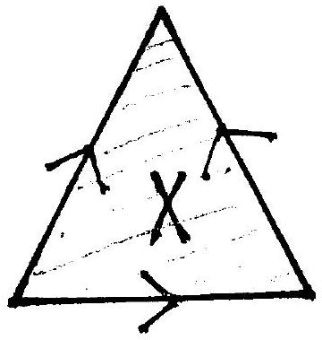

::: problem
The identification space $X$, shown below, is called the dunce hat.

Using van Kampen's theorem, compute the fundamental group of $X$.
:::

::: {.solution}
Let $D$ be the triangular disk before the boundary identifications, let $q:D\to X$ be the quotient map, and let $c\in\operatorname{int}(D)$.

<1>1. The identified boundary $q(\partial D)$ is a circle, with fundamental group generated by one oriented edge class $a$.
::: {.proof}
The three boundary edges of the triangle are all identified to a single edge, and all three vertices are identified to a single vertex.
Thus the quotient of the boundary is a CW complex with one vertex and one edge, hence is homeomorphic to $S^1$.
Choose an orientation of this edge and denote the corresponding generator of its fundamental group by $a$.
:::

<1>2. There is a van Kampen cover $X=U\cup V$ with
\[
\pi_1(U)=1,
\qquad
\pi_1(V)=\langle a\rangle\cong\ZZ,
\qquad
\pi_1(U\cap V)\cong\ZZ.
\]
::: {.proof}
Take
\[
U=q(\operatorname{int}D)
\]
and
\[
V=X\setminus\{q(c)\}.
\]
The inverse images of $U$ and $V$ under $q$ are open in $D$, so both are open in the quotient topology.
The set $U$ is an open disk and is therefore simply connected.
The set $V$ is the quotient of the punctured disk $D\setminus\{c\}$ by the boundary identifications.
Radial deformation toward $\partial D$ fixes boundary points and therefore respects their identifications, so it descends to a deformation retraction
\[
V\simeq q(\partial D)\cong S^1.
\]
Finally,
\[
U\cap V=q(\operatorname{int}D\setminus\{c\})
\]
is a punctured open disk, hence deformation retracts to a circle.
All three spaces are path connected, so van Kampen applies.
:::

<1>3. Under the inclusion $U\cap V\hookrightarrow V$, a positive generator of $\pi_1(U\cap V)$ maps to the word
\[
aa a^{-1}=a
\]
up to cyclic permutation or inversion.
::: {.proof}
A generator of $\pi_1(U\cap V)$ is represented by a small loop once around the missing point $c$.
Under the radial deformation in <1>2, this loop becomes one traversal of the boundary of the triangle.
Reading that traversal against the three edge arrows in the official diagram, two boundary edges are traversed in the chosen direction of $a$ and the remaining edge in the opposite direction.
Hence the attaching word is
\[
aa a^{-1},
\]
up to changing the starting vertex or reversing the traversal.
In the free group on $a$, this word equals $a$.
:::

<1>4. Van Kampen therefore gives
\[
\pi_1(X)
\cong
\langle a\mid aa a^{-1}=1\rangle
=
\langle a\mid a=1\rangle
=1.
\]
::: {.proof}
The inclusion $U\cap V\hookrightarrow U$ induces the trivial map because $U$ is simply connected.
Van Kampen therefore quotients $\pi_1(V)=\langle a\rangle$ by the normal closure of the image found in <1>3. That image is the generator $a$ itself, so the quotient group is trivial.
Thus the dunce hat is simply connected.
:::
:::
