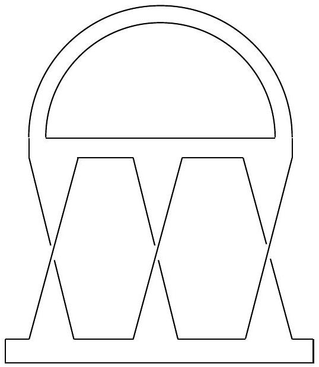

::: problem
State the classification theorem for compact surfaces and identify the surface drawn on the exam on your list.

:::

::: {.solution}
<1>1. The classification theorem says that every compact connected surface is homeomorphic to exactly one surface of one of the following two forms:
\[
\Sigma_{g,b}
=
\left(\#^g T^2\right)
\setminus
\bigsqcup_{i=1}^{b}\operatorname{int}(D_i^2),
\qquad g,b\ge0,
\]
or
\[
N_{k,b}
=
\left(\#^k\RP^2\right)
\setminus
\bigsqcup_{i=1}^{b}\operatorname{int}(D_i^2),
\qquad k\ge1,\ b\ge0.
\]
The first family is orientable and the second is nonorientable; the displayed parameters are unique.
::: {.proof}
This is the classification theorem for compact connected surfaces.
Equivalently, a compact connected surface is determined up to homeomorphism by whether it is orientable, its genus (or nonorientable genus), and its number of boundary components.
For $g=0$, the convention in the first display is $\#^0T^2=S^2$.
If a compact surface is disconnected, apply this statement to each connected component.
:::

<1>2. Their Euler characteristics are
\[
\chi(\Sigma_{g,b})=2-2g-b,
\qquad
\chi(N_{k,b})=2-k-b.
\]
::: {.proof}
The closed orientable genus-$g$ surface has Euler characteristic $2-2g$, and the closed nonorientable genus-$k$ surface has Euler characteristic $2-k$.
Removing the interior of one disk decreases the Euler characteristic by one, so removing $b$ disjoint open disks gives the displayed formulas.
:::

<1>3. The surface in the official drawing is
\[
\boxed{\Sigma_3=T^2\#T^2\#T^2},
\]
the closed orientable surface of genus $3$.
::: {.proof}
The drawing shows a closed surface with three ordinary orientable handles and no boundary components.
Starting with a sphere and attaching those three handles gives
\[
S^2\#T^2\#T^2\#T^2
\cong
T^2\#T^2\#T^2
=\Sigma_3.
\]
As a numerical check, <1>2 gives
\[
\chi(\Sigma_3)=2-2\cdot3=-4.
\]
Thus the pictured surface occurs in the orientable family with $(g,b)=(3,0)$.
:::
:::
