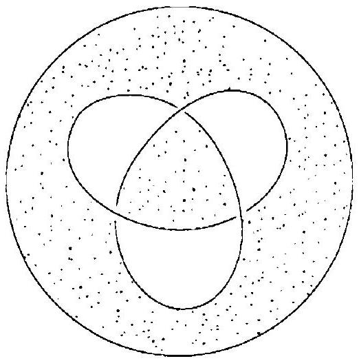

::: problem
Use the classification of surfaces to identify the surface drawn below.

:::

::: {.solution}
<1>1. The three-lobed broken curve in the diagram is one three-crossing trefoil diagram, not three separate closed curves.
The stippled checkerboard surface is obtained from exactly two disk regions, the central region and the outer region, by joining them with one band at each of the three crossings.
::: {.proof}
At every crossing, the gap records which branch passes under the other; following the strands through all three crossings gives a single closed component, the standard trefoil projection.

For the checkerboard construction, each stippled region thickens to a disk and each crossing contributes a narrow band joining the two incident stippled regions.
The picture has exactly two stippled regions and three crossings, so the resulting compact surface has two disk pieces and three bands.
:::

<1>2. The surface is connected and has Euler characteristic
\[
\chi=2-3=-1.
\]
::: {.proof}
The two disk pieces are $0$-handles and the three crossing bands are $1$-handles.
Every band joins the two disk pieces, so the surface is connected.
Euler characteristic is additive over this handle description:
\[
\chi=(\text{number of $0$-handles})-(\text{number of $1$-handles})=2-3=-1.
\]
Equivalently, the surface deformation retracts onto the theta graph with two vertices and three edges.
:::

<1>3. The surface is orientable.
::: {.proof}
Collapse each stippled disk to a vertex and each crossing band to an edge.
The resulting spine is the theta graph: two vertices joined by three edges.

Traversing one crossing band interchanges the two local sides of the planar disk pieces.
Thus a global choice of side is consistent precisely when every closed route through the band spine uses an even number of bands.
The theta graph is bipartite, with the two disk vertices as its two parts, so every closed route has even length.
Hence the checkerboard surface is two-sided, and therefore orientable.
:::

<1>4. The surface has exactly one boundary component.
::: {.proof}
The boundary of the checkerboard surface follows the strands of the original knot diagram.
By <1>1 those strands form a single trefoil knot, so
\[
b=1.
\]
:::

<1>5. By the classification of compact connected orientable surfaces, the surface is a once-punctured torus:
\[
\boxed{T^2\setminus\operatorname{int}(D^2)}.
\]
::: {.proof}
An orientable compact connected surface of genus $g$ with $b$ boundary components has Euler characteristic
\[
\chi=2-2g-b.
\]
By <1>2 and <1>4,
\[
-1=2-2g-1=1-2g,
\]
so $g=1$.
The unique orientable surface with genus $1$ and one boundary component is a torus with the interior of one disk removed.
:::
:::
