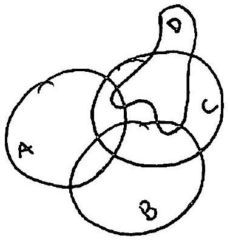

::: problem
The nerve of a collection of sets is an abstract simplicial complex that has a $0$-cell for each set, a $1$-cell joining each pair of sets that intersect each other, a $2$-cell for every triple of sets with a common intersection, and so forth.
Consider the collection of sets below:

a. Draw the nerve of the collection.

b. Compute the homology of the nerve.
:::

::: {.solution}
<1>1. The nonempty intersections visible in the diagram are all six pairwise intersections and exactly the three triple intersections
\[
A\cap B\cap C,
\qquad
A\cap C\cap D,
\qquad
B\cap C\cap D.
\]
The intersection $A\cap B\cap D$ is empty, and hence so is $A\cap B\cap C\cap D$.
::: {.proof}
The three large regions $A$, $B$, and $C$ overlap pairwise and have a common central region, so
\[
A\cap B,
\quad
A\cap C,
\quad
B\cap C,
\quad
A\cap B\cap C
\]
are nonempty.

The region $D$ meets each of $A$, $B$, and $C$.
Its small overlap with $A$ is the lens immediately to the left of the lower part of $D$; that lens lies inside $C$ and above $B$.
Thus
\[
A\cap C\cap D\ne\varnothing
\qquad\text{but}\qquad
A\cap B\cap D=\varnothing.
\]
Its small overlap with $B$ is the lens immediately below the lower boundary of $D$; that lens lies inside $C$ and to the right of $A$.
Thus
\[
B\cap C\cap D\ne\varnothing.
\]
Since $A\cap B\cap D$ is empty, no point lies in all four sets.
:::

<1>2. Therefore the nerve $N$ has vertices
\[
A,B,C,D,
\]
all six edges
\[
AB,AC,AD,BC,BD,CD,
\]
and precisely the three $2$-simplices
\[
ABC,
\qquad
ACD,
\qquad
BCD.
\]
There is no $2$-simplex $ABD$ and no $3$-simplex $ABCD$.
::: {.proof}
This is exactly the definition of the nerve applied to the intersection list in <1>1. Equivalently,
\[
N=C*\partial\Delta^2_{ABD},
\]
the cone with apex $C$ on the $3$-cycle with vertices $A,B,D$.
Thus one may draw the complete graph on the four vertices, fill the three triangular faces incident to $C$, and leave the face $ABD$ unfilled.
:::

<1>3. With integral coefficients,
\[
\boxed{
H_0(N;\ZZ)\cong\ZZ,
\qquad
H_n(N;\ZZ)=0\quad(n\ge 1).
}
\]
::: {.proof}
By <1>2, $N$ is a simplicial cone with apex $C$.
Its geometric realization contracts to $C$: if $x\in |N|$ has barycentric coordinates in a simplex of $N$, define
\[
H(x,t)=(1-t)x+tC,
\qquad 0\le t\le 1.
\]
Every simplex of the base $\partial\Delta^2_{ABD}$ together with $C$ is a simplex of the cone, so the whole line segment from $x$ to $C$ remains in $|N|$.
Hence $|N|$ is contractible.
Therefore its reduced integral homology vanishes in every degree, which gives the displayed groups.
:::
:::
