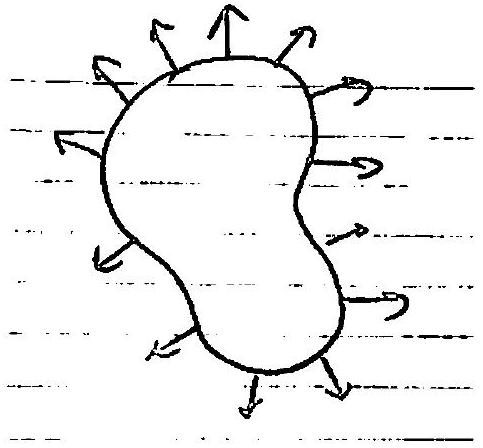

::: problem
A continuous vector field $V$ on the plane is a continuous map from $\RR^2$ to $\RR^2$.
The portion of $V$ along the boundary of a disk $D$ is shown below:

Show that the vector field has a zero inside $D$.
:::

::: {.solution}
Let $c$ be the center of $D$.
The boundary condition shown in the figure says that $V(x)$ points strictly outward for every $x\in\partial D$; equivalently,
\[
\langle V(x),x-c\rangle>0
\qquad(x\in\partial D).
\]

<1>1. If $V$ had no zero in $D$, then the normalized field
\[
u:D\longrightarrow S^1,
\qquad
u(x)=\frac{V(x)}{\|V(x)\|},
\]
would be continuous, and its restriction to $\partial D$ would have degree $0$.
::: {.proof}
Under the assumption that $V(x)\ne0$ on $D$, the displayed normalization is well defined and continuous.
Since $u|_{\partial D}$ extends continuously over the disk, it is null-homotopic: contract $D$ to its center and compose that contraction with $u$.
A null-homotopic map $S^1\to S^1$ has degree $0$.
:::

<1>2. The same boundary map $u|_{\partial D}$ has degree $1$.
::: {.proof}
Let
\[
n(x)=\frac{x-c}{\|x-c\|},
\qquad x\in\partial D,
\]
be the outward radial unit field.
For $0\le t\le1$, set
\[
W_t(x)=(1-t)V(x)+t(x-c).
\]
Then
\[
\langle W_t(x),x-c\rangle
=(1-t)\langle V(x),x-c\rangle+t\|x-c\|^2>0,
\]
so $W_t(x)\ne0$ for every $x\in\partial D$ and every $t$.
Therefore
\[
H_t(x)=\frac{W_t(x)}{\|W_t(x)\|}
\]
is a homotopy through maps $\partial D\to S^1$ from $u|_{\partial D}$ to $n$.

After the standard orientation-preserving identification $\partial D\cong S^1$, the map $n$ is the identity map of $S^1$.
Hence
\[
\deg(u|_{\partial D})=\deg(n)=1.
\]
:::

<1>3. Thus $V$ has a zero in the interior of $D$.
::: {.proof}
If $V$ had no zero in $D$, <1>1 and <1>2 would give simultaneously
\[
\deg(u|_{\partial D})=0
\qquad\text{and}\qquad
\deg(u|_{\partial D})=1,
\]
a contradiction.
Therefore $V$ vanishes somewhere in $D$.
The pictured boundary condition implies $V(x)\ne0$ for every $x\in\partial D$, so every zero lies in the interior.
:::
:::
