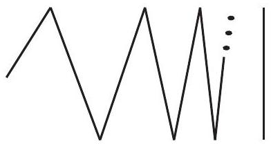

::: problem
Compute $H_0(X)$ where $X$ is shown in Figure 1.

:::

::: {.solution}
Let $G$ be the oscillating zigzag part of the figure and let $V$ be the vertical limit segment, so
\[
X=G\cup V.
\]
In the standard coordinate model represented by the figure, $G$ is the graph of a continuous piecewise-linear function
\[
h:(0,1]\longrightarrow\RR
\]
whose alternating peaks and valleys occur at sequences tending to $0$, while
\[
V=\{0\}\times [u,v]
\]
is the limiting vertical segment, where $u<v$ are the valley and peak levels.

<1>1. The sets $G$ and $V$ are path-connected.
::: {.proof}
The map
\[
(0,1]\longrightarrow G,
\qquad
x\longmapsto (x,h(x)),
\]
is a homeomorphism: its inverse is projection onto the first coordinate.
Since $(0,1]$ is path-connected, so is $G$.

The set $V$ is an interval, hence path-connected.
:::

<1>2. There is no path in $X$ from a point of $V$ to a point of $G$.
::: {.proof}
Suppose for contradiction that
\[
\gamma:[0,1]\longrightarrow X,
\qquad
\gamma(t)=(\xi(t),\eta(t)),
\]
is a path with $\gamma(0)\in V$ and $\gamma(1)\in G$.
The set
\[
Z=\{t\in[0,1]:\xi(t)=0\}
\]
is nonempty and closed, while $1\notin Z$.
Let
\[
t_0=\max Z<1.
\]
Then
\[
\xi(t)>0
\qquad(t_0<t\le1),
\]
so on this interval the path lies in $G$ and therefore
\[
\eta(t)=h(\xi(t)).
\]

Choose sequences of horizontal coordinates
\[
x_n^+\to0,
\qquad
x_n^-\to0,
\]
at successive peaks and valleys of the zigzag, so that
\[
h(x_n^+)=v,
\qquad
h(x_n^-)=u.
\]
Fix any $s\in(t_0,1]$.
Since $\xi(t_0)=0$ and $\xi(s)>0$, the intermediate value theorem shows that every sufficiently small $x_n^\pm$ is attained by $\xi$ somewhere in $(t_0,s)$.
Choose such times $t_n^\pm$ with
\[
\xi(t_n^\pm)=x_n^\pm.
\]

These times can be chosen with
\[
t_n^\pm\longrightarrow t_0.
\]
Indeed, for every $\varepsilon>0$, the continuous positive function $\xi$ has a positive minimum on the compact interval $[t_0+\varepsilon,s]$; once $x_n^\pm$ is smaller than this minimum, any time at which $\xi=x_n^\pm$ must lie in $(t_0,t_0+\varepsilon)$.

Consequently,
\[
\eta(t_n^+)=v,
\qquad
\eta(t_n^-)=u,
\]
with both sequences of times tending to $t_0$.
Since $u\ne v$, the second coordinate $\eta(t)$ cannot be continuous at $t_0$, contradicting continuity of $\gamma$.

Hence no such path exists.
:::

<1>3. The space $X$ has exactly two path components, namely $G$ and $V$.
::: {.proof}
By <1>1, both $G$ and $V$ are path-connected.
By <1>2, no path joins a point of one to a point of the other.
Since $X=G\cup V$, these are exactly the two path components.
:::

<1>4. Therefore
\[
\boxed{H_0(X;\ZZ)\cong\ZZ\oplus\ZZ.}
\]
::: {.proof}
For any space, singular $H_0$ is the direct sum of one copy of $\ZZ$ for each path component.
By <1>3, $X$ has two path components.
Hence
\[
H_0(X;\ZZ)\cong\ZZ^2.
\]
:::
:::
