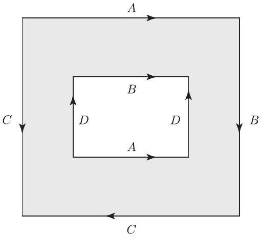

::: problem
Let $Y$ be the annulus with identifications as shown in Figure 2.

(a) Explain why $Y$ is a surface.

(b) Is $Y$ orientable?

(c) What surface is $Y$?
:::

::: {.solution}
Label the outer corners, clockwise from the upper left, by
\[
a,b,c,d,
\]
and the inner corners, clockwise from the upper left, by
\[
e,f,g,h.
\]
Thus the oriented labeled edges in Figure 2 are
\[
\begin{array}{c|c}
\text{edge} & \text{arrow direction}\\ \hline
A & a\to b,\quad h\to g,\\
B & b\to c,\quad e\to f,\\
C & c\to d,\quad a\to d,\\
D & h\to e,\quad g\to f.
\end{array}
\]

<1>1. The edge identifications give exactly two quotient vertices:
\[
v_1=\{a,b,c,e,f,g,h\},
\qquad
v_2=\{d\}.
\]
::: {.proof}
Matching initial and terminal endpoints of equally labeled arrows gives
\[
\begin{aligned}
A:&\quad a\sim h,\quad b\sim g,\\
B:&\quad b\sim e,\quad c\sim f,\\
C:&\quad c\sim a,\quad d\sim d,\\
D:&\quad h\sim g,\quad e\sim f.
\end{aligned}
\]
The first, second, fourth, and the nontrivial part of the third line connect
\[
a,b,c,e,f,g,h
\]
into one equivalence class, while no identification joins $d$ to any other corner.
:::

<1>2. Every point of $Y$ has a neighborhood homeomorphic to an open disk; hence $Y$ is a surface.
::: {.proof}
Interior points of the annulus already have disk neighborhoods.
An interior point of a boundary edge has a half-disk neighborhood on each of the two paired edges; the identification glues the two half-disks along their boundary diameters, producing a disk neighborhood.

It remains to check the quotient vertices from <1>1.
At a corner of the annulus, a sufficiently small link is an interval.
Following the endpoint identifications of these corner-link intervals around $v_1$ joins the seven intervals in the single cycle
\[
a\longrightarrow h\longrightarrow g\longrightarrow b
\longrightarrow e\longrightarrow f\longrightarrow c
\longrightarrow a.
\]
Thus the link of $v_1$ is a circle.
At $v_2=d$, the two endpoints of the one corner-link interval are identified by the $C$-pairing, so its link is also a circle.

The cone on a circle is a disk, so both quotient vertices have disk neighborhoods.
All boundary edges have been paired, so the quotient has no boundary.
Since the annulus is connected and a quotient of a connected space is connected, $Y$ is a closed connected surface.
:::

<1>3. The surface $Y$ is nonorientable.
::: {.proof}
Give the annulus its standard orientation as a planar region.
For an orientation to descend across an identification of two boundary arcs, the gluing homeomorphism must reverse the induced boundary orientations: the two inward half-disk neighborhoods then receive compatible orientations after gluing.

Consider the two edges labeled $A$.
On the outer top edge, the induced boundary orientation points left, whereas the displayed $A$-arrow points right.
On the inner bottom edge, the induced boundary orientation also points left, whereas its displayed $A$-arrow points right.
The $A$-identification matches the arrows, so it preserves rather than reverses the induced boundary orientation.
Hence no orientation of the annulus can descend through this seam.

Reversing the orientation of the annulus reverses both induced boundary orientations simultaneously and does not change the fact that the $A$-gluing preserves them.
Therefore $Y$ is nonorientable.
:::

<1>4. The Euler characteristic of $Y$ is
\[
\chi(Y)=-2.
\]
::: {.proof}
Triangulate the rectangular annulus using only its eight corners as vertices: join each outer corner to the corresponding inner corner, obtaining four quadrilateral strips, then add one diagonal in each strip.
This gives
\[
V=8,
\qquad
E=8+4+4=16,
\qquad
F=8,
\]
so indeed the annulus has Euler characteristic $8-16+8=0$.

Passing to the quotient changes only the boundary cells.
By <1>1, the eight boundary vertices become two vertices.
The eight boundary edges become the four edge orbits $A,B,C,D$.
The four radial edges, four diagonals, and eight open $2$-cells remain distinct open cells.
Thus the quotient CW structure has
\[
V_Y=2,
\qquad
E_Y=4+4+4=12,
\qquad
F_Y=8.
\]
Therefore
\[
\chi(Y)=2-12+8=-2.
\]
:::

<1>5. The surface is the connected sum of four projective planes:
\[
\boxed{Y\cong N_4=\#^4\RP^2.}
\]
::: {.proof}
By <1>2, $Y$ is a closed connected surface, and by <1>3 it is nonorientable.
The classification theorem for compact connected surfaces says that a closed nonorientable surface is
\[
N_k=\#^k\RP^2
\]
for a unique integer $k\ge1$, with
\[
\chi(N_k)=2-k.
\]
By <1>4,
\[
2-k=-2,
\]
so
\[
k=4.
\]
Hence $Y\cong N_4$.
:::
:::
