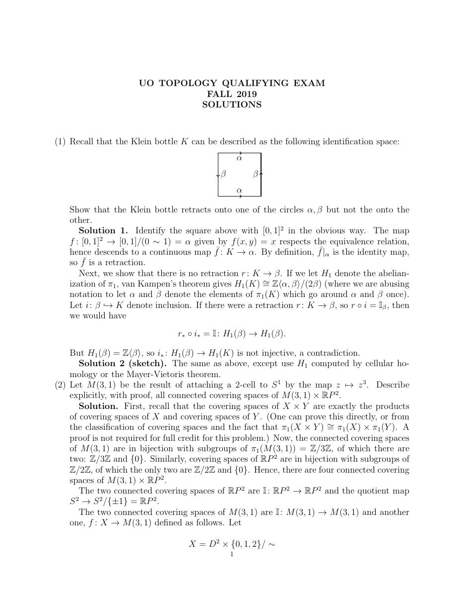

::: {.problem}
Recall the standard square-identification model of the Klein bottle $K$, with the two indicated circles $\alpha$ and $\beta$.

Show that the Klein bottle retracts onto one of the circles $\alpha,\beta$ but not onto the other.
:::
